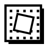

# Paplitz 📐

> Aplicación de código abierto para el aprendizaje de dibujo técnico, perspectiva y memoria muscular espacial. Inspirada en **Duolingo**, **Daromeon** y la metodología de **"Sketching: The Basics"** (*Koos Eissen & Roselien Steur*).



---

## 📚 Documentación Técnica para Desarrolladores y Agentes

Si vas a realizar tareas de desarrollo avanzadas o portar la app a otras plataformas, consulta la carpeta **[`docs/`](./docs/README.md)**:

* **[Índice Central de Documentación](./docs/README.md)**
* **[Arquitectura y Código](./docs/ARCHITECTURE.md)**
* **[Motor 3D y Perspectiva](./docs/GEOMETRY_AND_PERSPECTIVE.md)**
* **[Validador de Trazos](./docs/STROKE_EVALUATION_AND_SCORING.md)**
* **[Avatar Cubito](./docs/AVATAR_CUBITO.md)**
* **[Minijuegos y Niveles](./docs/MINIGAMES_AND_PROGRESSION.md)**
* **[Láminas PDF y Escáner QR](./docs/ANALOG_WORKSHEETS_AND_QR.md)**
* **📱 [GUÍA PORT ANDROID (Capacitor / S-Pen / Permisos)](./docs/PORTING_GUIDE_ANDROID.md)**
* **💻 [GUÍA EJECUTABLE WINDOWS .EXE (Tauri v2 / Electron)](./docs/PORTING_GUIDE_WINDOWS_EXE.md)**

---

## ✨ Características Principales

* **Estética Ink en Blanco y Negro Puro:** Diseñada con inspiración en manuales de dibujo industrial, fanzines técnicos y tramas de cómic/manga (*screentones / halftones*).
* **"El Camino" de Aprendizaje (Estilo Duolingo):** Progresión por unidades temáticas, calentamientos rápidos de trazo, retos contrarreloj, exámenes y guías teóricas integradas.
* **Motor Matemático 3D Offline:** Sin dependencias de Inteligencia Artificial externa, sin costes de API y 100% privado. La perspectiva cónica se valida por geometría analítica en milisegundos.
* **Soporte de Entrada Dual:**
  * **Digital:** Lienzo interactivo optimizado para tableta gráfica / lápiz digital (Apple Pencil, Wacom, S-Pen) con sensibilidad a la presión (`PointerEvents`).
  * **Analógico / Hojas A4:** Generador de plantillas PDF vectoriales imprimibles con 12 casillas codificadas y sistema para validar fotos o escaneos de los dibujos hechos con lápiz sobre papel.
* **Gamificación Local:** Sistema de racha diaria (Streak 🔥) y puntos de experiencia (XP) sin necesidad de registrarse ni crear cuentas.

---

## 🚀 Cómo Ejecutar en Local

Cualquier persona puede clonar y ejecutar el proyecto en su equipo en 2 minutos:

```bash
# 1. Clonar el repositorio
git clone https://github.com/tu-usuario/paplitz.git
cd paplitz

# 2. Instalar dependencias (requiere Node.js 18+)
npm install

# 3. Iniciar el servidor de desarrollo
npm run dev
```

Abre [http://localhost:5173](http://localhost:5173) en tu navegador.

---

## 📦 Construir para Producción

```bash
npm run build
```

Genera los archivos estáticos en la carpeta `dist/`, listos para publicar en **GitHub Pages**, **Vercel**, **Netlify** o empaquetar con **Tauri / Electron** para escritorio.

---

## 🛠️ Tecnologías Utilizadas

* **React 19** + **TypeScript**
* **Vite**
* **Tailwind CSS v4**
* **jsPDF** (para exportación vectorial de plantillas A4)
* **Lucide Icons**

---

## 💡 Inspiración y Referencias

Paplitz nació como un proyecto personal inspirado por grandes referentes del aprendizaje visual y la perspectiva:

* **[Daromeon](https://daromeon.com/)**: Agradecimiento especial por la inspiración conceptual original en herramientas de práctica de perspectiva. Paplitz toma esa chispa inicial y la reimagina con un enfoque propio: motor geométrico offline en TypeScript, gamificación estilo Duolingo, soporte de láminas analógicas y arquitectura multiplataforma.
* **"Sketching: The Basics"** (*Koos Eissen & Roselien Steur*): Referencia bibliográfica fundamental para los principios teóricos de dibujo industrial, puntos de fuga y construcción de elipses y cajas en perspectiva. *(Nota: El material bibliográfico y libros con copyright no están incluidos en este repositorio).*

---

## 📄 Licencia

Código abierto bajo licencia [MIT](LICENSE).
