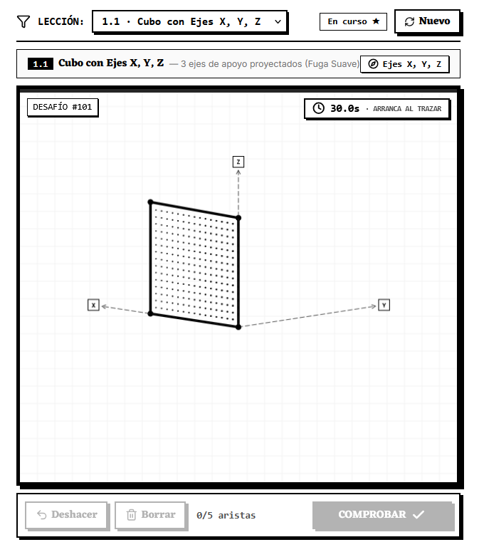
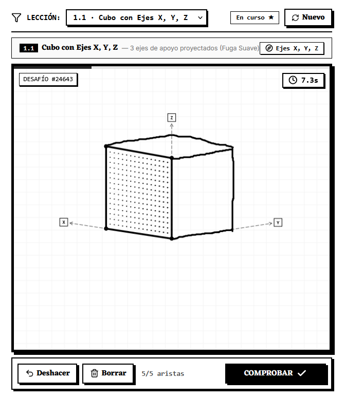
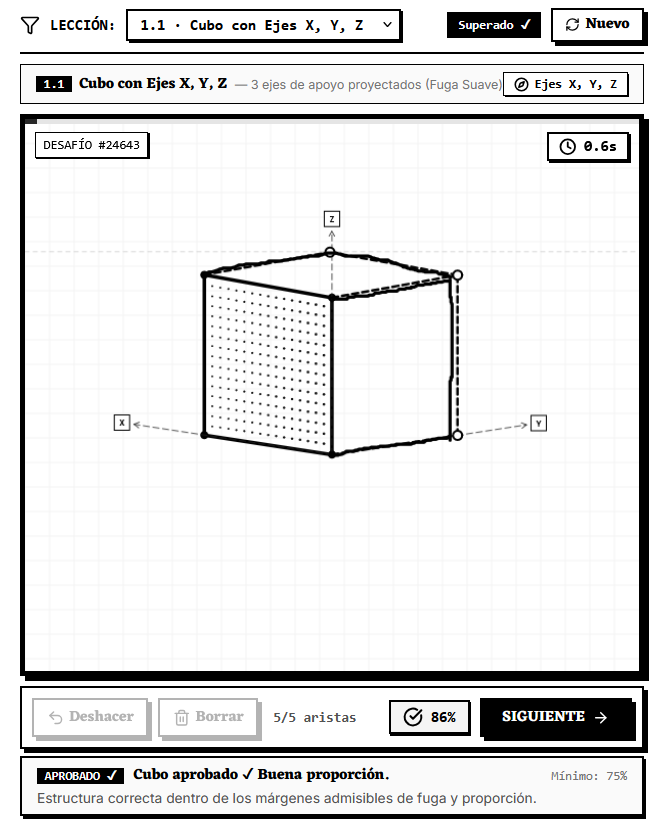

# Paplitz 📐

> An open-source interactive simulator and training tool for mastering technical sketching, 3D perspective, and spatial muscle memory. Inspired by **Duolingo**, **Daromeon**, and the instructional methodology of **"Sketching: The Basics"** (*Koos Eissen & Roselien Steur*).


[](LICENSE)
[](https://paplitz.vercel.app/)
[](https://github.com/lazaro-guerrero-losada/paplitz/releases/latest)
[](https://react.dev/)
[](https://www.typescriptlang.org/)
[](https://vitejs.dev/)
[](https://tailwindcss.com/)

---

### 📦 [**👉 Download Latest Releases (.exe for Windows & .apk for Android)**](https://github.com/lazaro-guerrero-losada/paplitz/releases/latest)
### 🌐 [**👉 Or Try the Live Web App Online (paplitz.vercel.app)**](https://paplitz.vercel.app/)

*No setup required! Works directly in modern desktop and mobile browsers, or download the native offline apps.*

---

## 🎮 How It Works & Gameplay Flow

Paplitz turns spatial perspective training into an intuitive, gamified loop:

| 1. Geometric Challenge | 2. Freehand Sketching | 3. Analytical Evaluation |
| :---: | :---: | :---: |
|  |  |  |
| **Step 1: The Setup**<br>The engine procedurally presents incomplete 3D forms with projective $X, Y, Z$ axes and vanishing guides. | **Step 2: Drawing**<br>Complete missing edges freehand using a drawing tablet, stylus, or mouse. Supports pressure sensitivity and stroke undo. | **Step 3: Instant Scoring**<br>The offline geometry engine calculates vanishing convergence, angle tolerance, and volume closure with instant feedback. |

---

## 🌟 Key Features

* 🖤 **Pure Black & White Ink Aesthetic:** Designed with inspiration from industrial design manuals, technical fanzines, and screentone / halftone manga aesthetics.
* ☁️ **Cloud Sync & Rescue Saves (Supabase):** Sync your progress, level, XP, streak, and unlocked lessons across all devices with private user recovery codes or offline JSON save backup files.
* 👥 **Classrooms & Student Groups:** Perfect for design schools, universities, and drawing workshops. Teachers can create groups with join codes to track student practice and progress.
* 📱 **Mobile Responsive & Landscape APK:** Dedicated mobile experience with an *Ink Drawer* navigation menu, and native Android APK locked to horizontal mode (`sensorLandscape`) for maximum drawing area.
* 🗺️ **Learning Path ("The Path" - Duolingo-Style):** Progressive thematic units, stroke warm-ups, time-attack challenges, placement exams, and integrated theoretical guides.
* 🧮 **Offline 3D Mathematical Engine:** Zero external AI dependencies, zero API costs, and 100% private. Conic and cylindrical perspective calculations are validated purely through analytical geometry in sub-milliseconds.
* ✏️ **Dual Input Support:**
  * **Digital Canvas:** Highly responsive drawing canvas optimized for drawing tablets & styluses (Wacom, Apple Pencil, S-Pen, Huion) with pressure sensitivity and tilt (`PointerEvents`).
  * **Analog Worksheets (A4):** Printable vector PDF generator with 12 encoded challenge slots and an integrated camera scanner to validate real-world pencil drawings on paper.
* 🧊 **Interactive 3D Avatar ("Sensei Cubito"):** Draggable mascot that reacts in real-time to your strokes, accuracy, mistakes, and combos.
* 🕹️ **Arcade & Minigame Modes:** *Fever*, *Blitz*, *Survival*, and *Speed Sprint* modes for fast-paced muscle memory drills.
* ⚡ **Gamification & Daily Streaks:** Streak tracking, XP progression, level titles, and milestone achievements.

---

## 📚 Technical Documentation for Developers

For deep architectural insights, mathematical formulations, or platform porting guides, explore the [`docs/`](./docs/README.md) directory:

* 📖 **[Documentation Index](./docs/README.md)**
* 🏗️ **[Architecture & Component Tree](./docs/ARCHITECTURE.md)**
* 📐 **[3D Geometry & Perspective Engine](./docs/GEOMETRY_AND_PERSPECTIVE.md)**
* 🎯 **[Stroke Evaluation & Scoring Algorithms](./docs/STROKE_EVALUATION_AND_SCORING.md)**
* 🧊 **[Sensei Cubito Avatar System](./docs/AVATAR_CUBITO.md)**
* 🎮 **[Minigames & Progression Engine](./docs/MINIGAMES_AND_PROGRESSION.md)**
* 📄 **[Analog Worksheets & QR Scanner](./docs/ANALOG_WORKSHEETS_AND_QR.md)**
* 📱 **[Android Porting Guide (Capacitor / S-Pen)](./docs/PORTING_GUIDE_ANDROID.md)**
* 💻 **[Windows Executable Guide (Electron / Tauri)](./docs/PORTING_GUIDE_WINDOWS_EXE.md)**

---

## 🚀 Getting Started

### Prerequisites
* [Node.js](https://nodejs.org/) (version 18 or higher)
* `npm` (comes with Node.js)

### Local Development

```bash
# 1. Clone the repository
git clone https://github.com/lazaro-guerrero-losada/paplitz.git
cd paplitz

# 2. Install dependencies
npm install

# 3. Start development server
npm run dev
```

Open [http://localhost:5173](http://localhost:5173) in your browser.

---

## 📦 Building for Production & Multiplatform

### Web (Production Bundle)
```bash
npm run build
```
Generates optimized static assets in the `dist/` directory, ready to deploy instantly on **Vercel**, **Netlify**, or **GitHub Pages**.

### Windows Executable (`.exe`)
```bash
npm run electron:build
```
Produces an installer (`.exe`) inside `dist_electron/`.

### Android (`.apk`)
```bash
npm run build:android
npm run cap:open
```
Syncs the web build with Android Studio to compile the native `.apk`.

---

## 🛠️ Tech Stack

* **Frontend:** React 19, TypeScript, Vite, Tailwind CSS v4
* **Canvas & Input:** HTML5 Canvas, Pointer Events API (Pressure & Tilt)
* **Geometry Engine:** Pure Analytical Geometry & Vector Math (0 dependencies)
* **Document & Scanner:** jsPDF (Vector A4 sheets), jsQR & pdfjs-dist (Camera & PDF validation)
* **Desktop & Mobile:** Electron & Capacitor

---

## 💡 Acknowledgments & References

Paplitz was born as a passion project inspired by pioneer works in perspective learning and visual education:

* **[Daromeon](https://daromeon.com/)**: Special acknowledgment for the early conceptual inspiration on perspective practice tools. Paplitz builds upon this idea with a unique architecture: a custom offline 3D geometric engine in TypeScript, Duolingo-style gamification, analog A4 worksheet printing with QR camera scanning, and full cross-platform support.
* **"Sketching: The Basics"** (*Koos Eissen & Roselien Steur*): Primary pedagogical reference for theoretical foundations in industrial sketching, vanishing points, ellipse construction, and spatial projection. *(Note: Copyrighted book materials are not included in this repository).*

---

## 📄 License

This project is licensed under the [MIT License](LICENSE).
