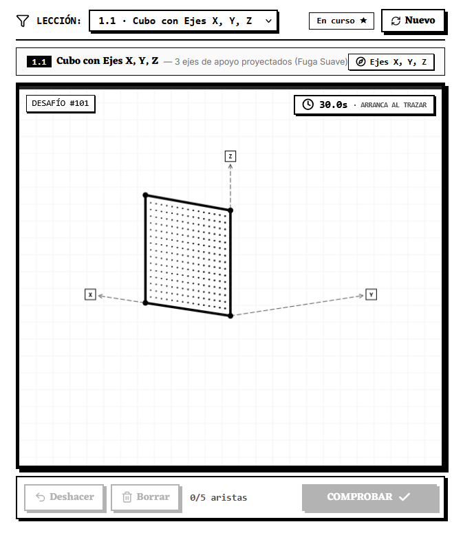
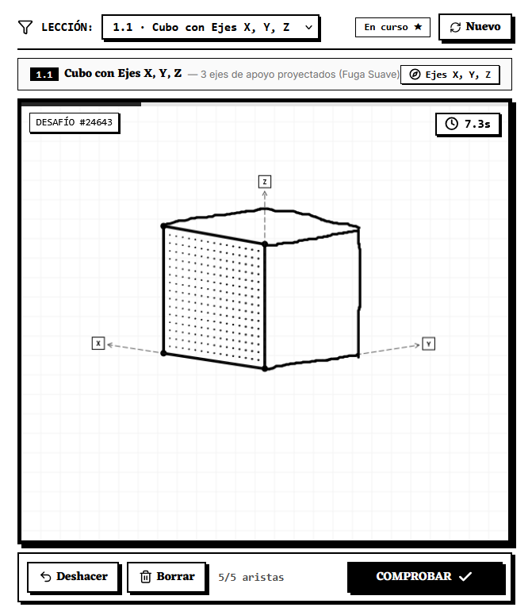
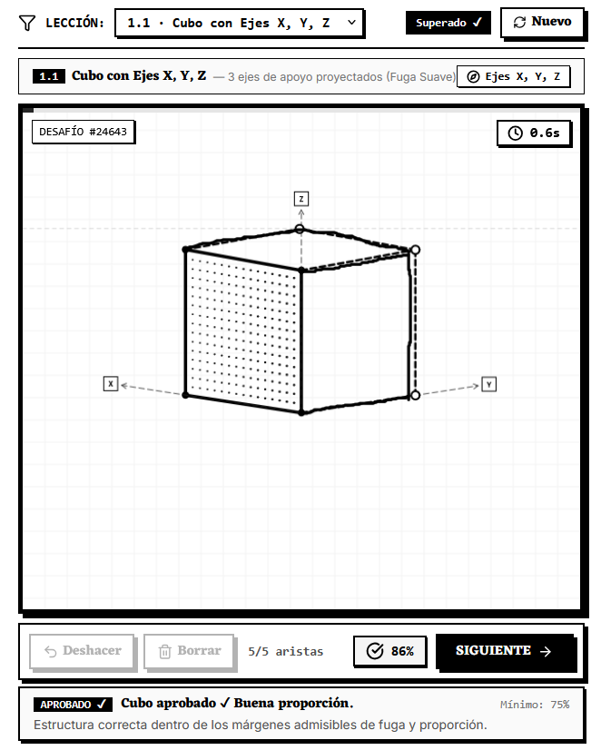
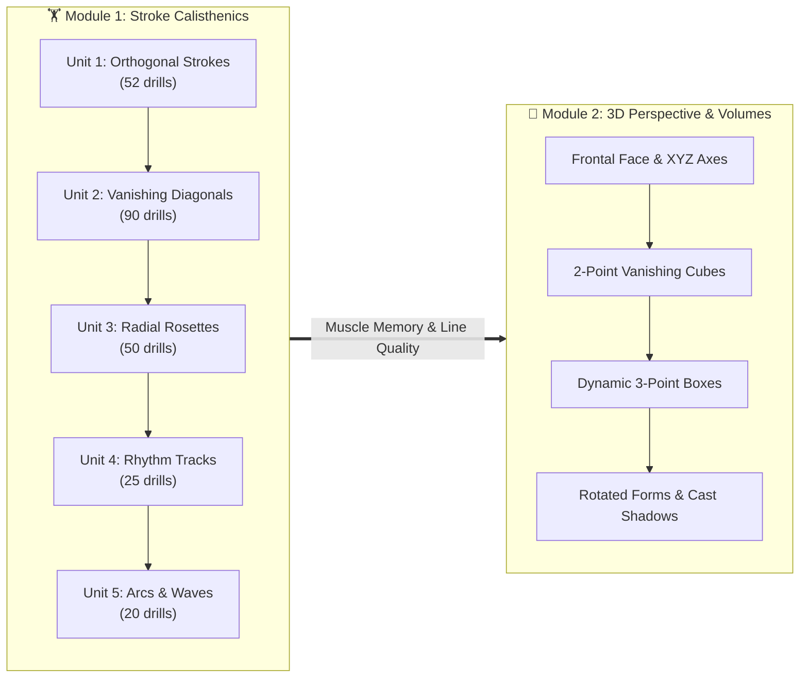

# Paplitz 📐

> **An Open-Source Digital Ecosystem for Real-Time Analytical Feedback and Visual Literacy: Sketching as a Universal Communication Tool.**
> 
> *“Drawing is not an innate gift—it is a learnable visual language. Paplitz transforms sketching anxiety into spatial muscle memory through real-time geometric feedback and deliberate practice.”*

<p align="center">
  
</p>

[](LICENSE)
[](https://paplitz.vercel.app/)
[](https://github.com/lazaro-guerrero-losada/paplitz/releases/latest)
[](https://react.dev/)
[](https://www.typescriptlang.org/)
[](https://vitejs.dev/)
[](https://tailwindcss.com/)

---

### 🌐 [**👉 Launch Live Web App (paplitz.vercel.app)**](https://paplitz.vercel.app/)
### 📦 [**👉 Download Standalone Desktop (.exe) & Android (.apk)**](https://github.com/lazaro-guerrero-losada/paplitz/releases/latest)

*Runs 100% client-side in any modern web browser or as offline native apps. Optimized for graphic tablets (Wacom, Huion) and active styluses (Apple Pencil, S-Pen) with pressure sensitivity.*

---

## 💡 What is Paplitz?

Freehand sketching has traditionally been confined to Fine Arts and Design schools. Yet, **drawing is not an innate talent**—it is a foundational cognitive skill closely tied to visual-spatial processing, comparable to learning how to read. 

In engineering and scientific disciplines, sketching is often neglected in favor of formal text or premature 3D CAD modeling. This deprives students and researchers of an agile medium to ideate, explore hypotheses, and defend complex concepts.

**Paplitz** bridges this transdisciplinary gap as a **visual literacy platform**:
* **Democratizes the 3D stroke:** Deconstructs spatial drawing into bite-sized, measurable micro-drills.
* **Overcomes the "blank canvas anxiety":** Replaces subjective grading with instant, quantitative, and non-punitive geometric feedback.
* **Empowers sketching as a universal communication tool:** Giving anyone the muscle memory to prototype, debate, and share ideas without technological or financial barriers.

---

## 🎮 The Practice Loop: How It Works

Paplitz turns technical perspective practice into an intuitive, high-tempo 3-step loop:

| 1. Geometric Challenge | 2. Freehand Sketching | 3. Instant Analytical Evaluation |
| :---: | :---: | :---: |
|  |  |  |
| **Procedural Setup**<br>The engine generates unique forms with projective $X, Y, Z$ director axes and vanishing guides. | **Freehand Drawing**<br>Complete missing edges on an ergonomic canvas with pressure sensitivity and live stroke stabilization. | **Quantitative Scoring**<br>In $<1.5\text{ ms}$, the engine computes vanishing convergence, edge closure, and actionable diagnostic cues ($\ge 80\%$ to pass). |

---

## 🗺️ Learning Curriculum: The 2 Core Modules

To prevent cognitive overload, Paplitz separates **neuromuscular line control** from **3D spatial projection**:


```mermaid
flowchart LR
    subgraph M1["🏋️ Module 1: Stroke Calisthenics"]
        A["Unit 1: Orthogonal Strokes\n(52 drills)"] --> B["Unit 2: Vanishing Diagonals\n(90 drills)"]
        B --> C["Unit 3: Radial Rosettes\n(50 drills)"]
        C --> D["Unit 4: Rhythm Tracks\n(25 drills)"]
        D --> E["Unit 5: Arcs & Waves\n(20 drills)"]
    end
    subgraph M2["📐 Module 2: 3D Perspective & Volumes"]
        F["Frontal Face & XYZ Axes"] --> G["2-Point Vanishing Cubes"]
        G --> H["Dynamic 3-Point Boxes"]
        H --> I["Rotated Forms & Cast Shadows"]
    end
    M1 ==>|Muscle Memory & Line Quality| M2
```

### 🏋️ Módulo 1: Calistenia del Trazo (237 Procedural Exercises)
Grouped into **18 progressive levels** with dynamic version advances. Every drill trains 3 biomechanical phases:
1. **Precision:** Guided motor accuracy connecting endpoints without geometric deviation.
2. **Flow:** Continuous forearm rhythm eliminating hesitation and jitter.
3. **Speed:** Confident ballistic strokes with clean terminal lift-offs.

### 📐 Módulo 2: Paralelepípedos & Perspectiva 3D
10 progressive spatial levels moving from single assisted edges to rotated isometric boxes, blind 3-point perspective, ground grids, and cast shadows with light source projection.

---

## 🕹️ Practice Modes & Gamification

* 🗺️ **El Camino (The Path):** Sequential curriculum with **Strict Mastery Progression** (requires 3 consecutive successes $\ge 90\%$ to unlock subsequent levels) and dynamic procedural variants.
* 🎯 **Reto Diario (Daily Habit Sets):** Practice sets of **6, 12 (Recommended), 18, or 24** exercises inspired by classic physical sheets, complete with historical scorecards and habit bonuses.
* ⚡ **Arcade & Minigames:**
  * 👻 **Línea Fantasma:** Train timing and stroke memory following disappearing ghost lines.
  * 🌊 **Avalancha de Trazos:** High-density stroke stacking under dynamic threshold evaluation.
  * 🔥 **Fever, Blitz, Survival & Speed Sprint:** High-tempo drills against the clock.
* 🧊 **Sensei Cubito (3D Affective Mascot):** Procedural 3D companion that focuses when you draw, celebrates with star-eyes on high accuracy, and offers encouraging empathy on mistakes.

---

## 🛠️ The Technology: 100% Client-Side Engine

Unlike opaque AI models that require cloud servers, introduce latency, and hallucinate arbitrary grades, Paplitz runs on **pure vector analytical geometry**:

* ⚡ **Sub-1.5 ms Latency:** Operates entirely in the browser with zero external server dependencies, zero API costs, and total data privacy.
* ✂️ **Anatomical Corner Splitting:** Human sketchers naturally draw connected 'L' or 'U' strokes. The engine detects inflection angles ($\theta > 42^\circ$), splits strokes into geometric segments, and runs optimal bipartite greedy matching against target edges.
* ⚖️ **Weighted Multifactorial Scoring:**
  $$\text{Score} = 0.45 \cdot S_{\text{edges}} + 0.45 \cdot S_{\text{convergence}} + 0.10 \cdot S_{\text{cleanliness}}$$
* 📄 **Hybrid Analog-Digital Bridge:** Includes a **Vector A4 PDF Generator** (`jsPDF`) and **QR Camera Scanner** (`jsQR`) so students can draw with graphite on physical paper and scan their sheet for automated grading.
* ☁️ **Cloud Sync & Classrooms (Supabase):** Optional multi-device progress sync and group codes for design schools and university studios.

---

## 🚀 Quickstart & Building

### Prerequisites
* [Node.js](https://nodejs.org/) (v18+) and `npm`

### Local Development
```bash
# Clone the repository
git clone https://github.com/lazaro-guerrero-losada/paplitz.git
cd paplitz

# Install dependencies and start local dev server
npm install
npm run dev
```
Open [http://localhost:5173](http://localhost:5173) in your browser.

### Multiplatform Builds
```bash
# 1. Build production web bundle (outputs to /dist)
npm run build

# 2. Build standalone Windows .exe (NSIS installer & portable)
npm run electron:build

# 3. Sync & build native Android .apk
npm run build:android
npm run cap:open
```

---

## 📚 Technical Documentation

Explore the [`docs/`](./docs/README.md) directory for detailed engineering documentation:

* 📖 **[Documentation Index](./docs/README.md)**
* 🏗️ **[Architecture & Component Tree](./docs/ARCHITECTURE.md)**
* 📐 **[3D Geometry & Perspective Engine](./docs/GEOMETRY_AND_PERSPECTIVE.md)**
* 🎯 **[Stroke Evaluation & Scoring Algorithms](./docs/STROKE_EVALUATION_AND_SCORING.md)**
* 🧊 **[Sensei Cubito Avatar System](./docs/AVATAR_CUBITO.md)**
* 🎮 **[Minigames & Progression Engine](./docs/MINIGAMES_AND_PROGRESSION.md)**
* 📄 **[Analog Worksheets & QR Scanner](./docs/ANALOG_WORKSHEETS_AND_QR.md)**
* 📱 **[Android Porting Guide (Capacitor / S-Pen)](./docs/PORTING_GUIDE_ANDROID.md)**
* 💻 **[Windows Executable Guide (Electron)](./docs/PORTING_GUIDE_WINDOWS_EXE.md)**

---

## 💡 Acknowledgments & References

* **[Daromeon](https://daromeon.com/):** Conceptual inspiration for interactive web perspective practice.
* **"Sketching: The Basics"** (*Koos Eissen & Roselien Steur*): Pedagogical reference for industrial design perspective, horizon lines, and vanishing planes.
* **"Pen and Ink Drawing"** (*Alphonso Dunn*): Theoretical reference for line density, hatching, and stroke control.

---

## 👤 Author & Academic Research

* **Author:** **Lázaro Guerrero Losada**
* **Affiliation:** Student of M.Sc. in Industrial Engineering (UMA) & B.Sc. in Industrial Design Engineering and Product Development (*Universidad de Málaga — UMA*).
* **Research Line:** Digital Pedagogy & Transdisciplinary Design (*Congreso Internacional de Innovación Docente y Educación en Diseño*).
* **Contact:** `lazaroguerrerolosada@uma.es`
* **Live App:** [https://paplitz.vercel.app/](https://paplitz.vercel.app/)

---

## 📄 License

Open-source under the [MIT License](LICENSE). Free to use, adapt, and expand for education, research, and creative practice.
