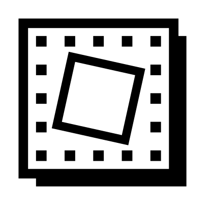
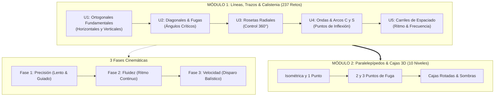

# Paplitz 📐

> **Open-Source Digital Pedagogical Ecosystem for Real-Time Analytical Feedback and Spatial Muscle Memory in Technical Perspective & Industrial Sketching.**
> 
> *“Transforming the frustration of self-taught learning into iterative spatial mastery through open-source technology.”*



[](LICENSE)
[](https://paplitz.vercel.app/)
[](https://github.com/lazaro-guerrero-losada/paplitz/releases/latest)
[](https://react.dev/)
[](https://www.typescriptlang.org/)
[](https://vitejs.dev/)
[](https://tailwindcss.com/)

---

### 📦 [**👉 Download Latest Releases (.exe for Windows & .apk for Android)**](https://github.com/lazaro-guerrero-losada/paplitz/releases/latest)
### 🌐 [**👉 Or Launch the Live Web App Online (paplitz.vercel.app)**](https://paplitz.vercel.app/)

*100% free, runs client-side in any modern web browser or as native offline desktop/mobile apps. Fully optimized for graphics tablets, active styluses (Apple Pencil, S-Pen, Wacom, Huion) with pressure sensitivity, and desktop/mouse input.*

---

## 📑 Table of Contents

* [01. Background & Motivation: The Paradox of the Degree](#01-background--motivation-the-paradox-of-the-degree)
* [02. Pedagogical Foundations & The Digital Transition](#02-pedagogical-foundations--the-digital-transition)
* [03. Project Objectives](#03-project-objectives)
* [04. Didactic Methodology: "The Path" & The Practice Loop](#04-didactic-methodology-the-path--the-practice-loop)
* [05. Technical Engine: Analytical Geometric Evaluation Without Dependencies](#05-technical-engine-analytical-geometric-evaluation-without-dependencies)
* [06. Ecosystem Innovations: Hybrid A4 Worksheets & Sensei Cubo](#06-ecosystem-innovations-hybrid-a4-worksheets--sensei-cubo)
* [07. Open-Source Philosophy, Community & Future Roadmap](#07-open-source-philosophy-community--future-roadmap)
* [08. Conclusions & Summary](#08-conclusions--summary)
* [💻 Developer Quickstart & Multiplatform Builds](#-developer-quickstart--multiplatform-builds)
* [📚 Technical Documentation Directory](#-technical-documentation-directory)
* [👤 Authorship, Academic Affiliation & Contact](#-authorship-academic-affiliation--contact)

---

## 01. Background & Motivation: The Paradox of the Degree

### The Academic Problem: The Myth of "Spontaneous Sketching"
In university Industrial Design Engineering and Product Development degrees, students face a persistent pedagogical contradiction:
* **High Expectation Without Explicit Method:** Academic curricula demand high-fidelity freehand sketches from day one, yet rarely provide step-by-step motor training or deliberate practice frameworks for 3D perspective construction.
* **The Solitude of the Self-Taught Student:** Learners are left to practice on their own. Without real-time error correction, incorrect spatial intuition and misaligned vanishing habits solidify unnoticed over months of repetition.
* **Frustration and Premature CAD Dependency:** High cognitive entry barriers cause students to develop sketching anxiety, abandoning pencil ideation in favor of premature 3D CAD modeling that restricts creative exploration.
* **Absence of Quantitative Metric:** How does a student know if their box converges accurately toward the horizon line? On paper, feedback is non-existent until post-submission grading days or weeks later.

### The Solution: Paplitz Manifesto — Democratizing the 3D Stroke
Paplitz was born not merely as an application, but as a **technical and emotional manifesto**: *no design or engineering student should ever feel incapable of projecting an idea into three-dimensional space.*

* **Mission:** Provide an open, accessible digital motor trainer that decomposes conic perspective into measurable, gamified micro-exercises.
* **Vision:** Become the open-source standard for schools of industrial design, architecture, and fine arts worldwide, uniting students, educators, and researchers.
* **Core Values:** Universal access without hardware or economic paywalls, absolute privacy via offline client-side computation, mathematical rigor, and an honest black-and-white ink aesthetic.

---

## 02. Pedagogical Foundations & The Digital Transition

Paplitz bridges canonical design literature with modern interactive input hardware, directly resolving the friction of static physical paper.

### Canonical Foundations
* **"Sketching: The Basics"** (*Koos Eissen & Roselien Steur*):
  The European benchmark for industrial design sketching. Supplies theoretical grounding: horizon line construction, convergent vanishing planes, spatial coordinate axes ($X, Y, Z$), and volumetric decomposition.
* **"Pen and Ink Drawing"** (*Alphonso Dunn*):
  Foundational guide for stroke weight control, line density discipline, screentone / cross-hatching textures, and high-contrast monochrome ink rendering.
* **Daromeon Interactive & Duolingo Methodology**:
  Pioneering conceptual inspiration in interactive web perspective drills (Daromeon) combined with the proven habit-forming mechanisms of spaced micro-learning, daily streaks, and modular curriculum progression (Duolingo).

### Resolving the "Pain of Paper" (*El Dolor del Folio*)
* **The Friction of Physical Paper:** Setting up blank sheets, rulers, and erasers creates cognitive inertia. Paper waste, lack of portability, and zero tracking of historical improvement slow down learning.
* **The Era of the Active Stylus:** Today's students carry iPads, Samsung Galaxy Tabs with S-Pens, and graphics tablets (Wacom, Huion). These provide pressure sensitivity, natural stroke ergonomics, and frictionless iteration.
* **The Living Differentiator — Real-Time Evaluation:** On paper, an aspiring designer never knows *why* a box feels distorted. Paplitz calculates invisible projective rays in real time and highlights the exact angular or proportional discrepancy.

---

## 03. Project Objectives

### General Research & Development Objective
> *Develop, validate, and implement an open-source digital interactive training ecosystem for accelerated spatial muscle memory acquisition and geometric perspective correction in technical sketching, accessible to any student without economic or hardware barriers.*

### Core Project Pillars
1. **Decoupled Analytical Engine (Offline Speed):**
   A pure analytical 3D projection and evaluation engine executing entirely client-side on the user's device. Operates with sub-1.5 millisecond validation latency, zero cloud AI API costs, and total data sovereignty.
2. **Cognitive Scaffolding (Structured Curriculum):**
   Deconstruct spatial complexity into an incremental curriculum of 8 thematic units and over 32 structured lessons: from single assisted edges to rotated volumes and cast shadows.
3. **Emotional Engagement & Gamification:**
   Implement positive psychological reinforcement mechanisms (reactive Sensei Cubo mascot, daily streak counters, XP mastery tiers, arcade speed drills) that eliminate the fear of failure and nurture deliberate daily practice.
4. **Open Educational Ecosystem (Classrooms & Community):**
   Foster collaboration in design studios and university classrooms through student groups, shareable practice codes, and an unencumbered MIT license allowing educators and researchers to audit, customize, and expand the syllabus.

---

## 04. Didactic Methodology: "The Path" & The Two-Module Curriculum

Paplitz organizes spatial skill acquisition into a **two-module deliberate practice curriculum**, separating neuromuscular motor control from 3D projective construction to prevent cognitive overload:


```mermaid
flowchart TD
    subgraph M1["MÓDULO 1: Líneas, Trazos & Calistenia (237 Retos)"]
        U1["U1: Ortogonales Fundamentales\n(Horizontales y Verticales)"] --> U2["U2: Diagonales & Fugas\n(Ángulos Críticos)"]
        U2 --> U3["U3: Rosetas Radiales\n(Control 360°)"]
        U3 --> U4["U4: Ondas & Arcos C y S\n(Puntos de Inflexión)"]
        U4 --> U5["U5: Carriles de Espaciado\n(Ritmo & Frecuencia)"]
    end
    subgraph KP["3 Fases Cinemáticas"]
        F1["Fase 1: Precisión (Lento & Guiado)"] --> F2["Fase 2: Fluidez (Ritmo Continuo)"] --> F3["Fase 3: Velocidad (Disparo Balístico)"]
    end
    subgraph M2["MÓDULO 2: Paralelepípedos & Cajas 3D (10 Niveles)"]
        B1["Isométrica y 1 Punto"] --> B2["2 y 3 Puntos de Fuga"] --> B3["Cajas Rotadas & Sombras"]
    end
    M1 -.-> KP
    M1 ==> M2
```

### The 4 Principles of Cognitive Scaffolding
1. **Deconstruction of Motor vs Spatial Cognitive Load:** Beginners are not asked to build complex perspective boxes while their hand still hesitates or trembles. Module 1 trains forearm and shoulder motor stability across 237 procedural calisthenics drills. Once line confidence is cemented, Module 2 introduces 3D projective geometry.
2. **The 3 Kinematic Subphases (Calisthenics Engine):**
   * *Phase 1: Precision:* Slow, controlled stroke connecting anchor keypoints ① and ② without geometric deflection.
   * *Phase 2: Fluidity:* Continuous rhythmic execution using the forearm to eliminate micro-hesitations.
   * *Phase 3: Velocity:* High-speed ballistic flick strokes, building sketching confidence with clean release.
3. **The 3-in-a-Row Mastery Rule ($\ge 90\%$):** To conquer a node and unlock subsequent lessons, the student must achieve **3 consecutive passing trials with a score of $\ge 90\%$**, cultivating solid muscle memory rather than relying on fortuitous single attempts.
4. **Immediate Analytical Feedback Loop:** Finishing a stroke triggers instant percentage evaluation, deviation metrics, and progressive gamification (XP, streaks, and Sensei Cubo reactions).

---

### The Practice Workspace: Collapsible Sidebar & Immersive Canvas

The practice environment features an ergonomic, distraction-free layout designed specifically for graphic tablet and stylus workflows:
* **Collapsible Left Sidebar:** Consolidates all controls (mode switcher, lesson selector, mastery counters, drawing actions) into a neat panel that can be hidden with a single click (`<` / `>`) to maximize screen real estate.
* **Two Practice Modes:** Instant toggle between **El Camino** (structured curriculum progress) and **Reto Diario** (12-exercise daily habit sets).
* **Layer Toggles:** Switch between user stroke review and ghost/theoretical solutions at will.

---

## 05. Technical Engine: Analytical Geometric Evaluation Without Dependencies

Unlike opaque machine learning models that require heavy GPU servers, hallucinate arbitrary scores, and depend on costly APIs, Paplitz operates on **pure vector analytical geometry**.


```mermaid
flowchart LR
    A["Raw Pointer Events\n(Stylus / Mouse)"] --> B["Stroke Normalization\n& Resampling"]
    B --> C["Corner Splitting\n(Deflection θ > 42°)"]
    C --> D["Segment Pool\n[s₁, s₂, ... sₙ]"]
    D --> E["Bipartite Matching\n(Greedy Assignment)"]
    E --> F["Multifactorial Scoring\n45% Topology | 45% Angle | 10% Cleanliness"]
    F --> G["Instant Score (0-100%)\n& Visual Diagnostic Overlay"]
```

### The Real-World Sketching Problem: *Corner Splitting*
In authentic sketching, designers rarely lift the stylus at every single vertex; they trace continuous **"L"** or **"U"** shaped lines around corners. A naive evaluator expecting one discrete stroke per edge would penalize skilled designers with failing scores ($<15\%$).

Paplitz solves this through an anatomical corner-splitting algorithm (`src/lib/validation.ts`):
1. Samples discrete coordinate points along the raw stroke.
2. Computes normalized tangent vectors: $\vec{u}_k = \frac{P_{k+1} - P_k}{\|P_{k+1} - P_k\|}$.
3. Calculates local deflection angle: $\theta = \arccos(\vec{u}_k \cdot \vec{u}_{k+1})$.
4. When $\theta > 42^\circ$, a **corner inflection vertex** is detected.
5. The stroke is automatically split into constituent linear segments: $[A \to B] + [B \to C]$.
6. Dispatched into an **optimal bipartite greedy assignment** matching user segments with target 3D edges.

### Multifactorial Scoring Function (0% – 100%)
$$\text{Score} = 0.45 \cdot S_{\text{edges}} + 0.45 \cdot S_{\text{convergence}} + 0.10 \cdot S_{\text{cleanliness}}$$

* **Edge Completeness ($45\%$):** Topological volume verification. If an essential bounding edge is missing, the volume does not exist in projective space.
* **Geometric Vanishing Accuracy ($45\%$):** Dot product alignment between user segments and exact target vanishing rays, factoring in relative length and conic foreshortening.
* **Cleanliness & Stability ($10\%$):** Penalizes parasitic hand tremor and disconnected ghost strokes.
* **The Fundamental Rule:** An incomplete cube receives $0\%$. In technical drawing, missing boundary topology breaks the solid. Passing threshold is set to $\ge 80\%$.

---

## 06. Ecosystem Innovations: Hybrid A4 Worksheets & Sensei Cubo

### 1. The Analog-Digital Bridge: Vector A4 Worksheets with QR Calibration
For design studios, high schools, and students who cherish the tactile drag of physical graphite on paper, Paplitz includes a hybrid bridge:
* **Pure Vector PDF Generator (`jsPDF`):** Generates high-resolution printable A4 practice sheets with millimetric alignment grids and 12 procedurally generated perspective challenges.
* **High-Density QR Embedding:** Every challenge slot prints its own unique QR code containing seed parameters and vanishing coordinates.
* **Optical Camera Scanner:** Students point their smartphone or webcam at the completed paper worksheet; the computer vision scanner (`jsQR`) decodes the exercise, extracts drawn graphite marks, and scores them automatically.

### 2. Affective Mentorship: "Sensei Cubito" 3D Avatar
Learning perspective is mentally taxing. To transform frustration into empathy and motivation, Paplitz features an expressive 3D companion mascot powered by `@bible-strong/avatar-react`:
* **Working Focus:** Detects when the stylus touches the canvas; eyes concentrate and follow the drawing tip in real time.
* **Celebration:** Exceeding an $80\%$ score triggers joyful star eyes, jumping physics, and celebratory ink particles.
* **Empathy on Mistakes:** Rather than loud game-over sounds, Cubito shows sympathetic spirals and invites immediate re-trying.
* **60 FPS Physics & Evasion:** Fully draggable anywhere on the screen with dynamic boundary repulsion to avoid obstructing active drawing areas.

### 3. High-Tempo Arcade Minigames
Beyond the structured curriculum, Paplitz features dedicated speed and endurance drills:
* 🔥 **Fever:** Maintain dynamic perspective combos without breaking accuracy streaks.
* ⚡ **Blitz:** Rapid 60-second muscle memory drills against a ticking clock.
* 🛡️ **Survival:** Increasing difficulty where a single unclosed volume ends the run.
* ⏱️ **Speed Sprint:** Measure precise completion time across 5 consecutive cubes.

---

## 07. Open-Source Philosophy, Community & Future Roadmap

### The Universal Right to Master Sketching
* **Educational Democratization:** Professional CAD and design licenses often carry prohibitive costs. Paplitz is **100% free and open-source under the MIT License**.
* **Technological Sovereignty & Client-Side Privacy:** All geometric computation runs locally in the client browser. No personal data, drawings, or usage metrics are sold or transmitted to third-party servers.
* **☁️ Cloud Sync & Rescue Saves (Supabase):** Seamlessly synchronize progress, unlocked units, streak, and XP across multiple devices with private recovery codes or offline JSON save backup files—no mandatory email registration required.
* **👥 Classrooms & Teacher Hubs:** Instructors can group students via simple classroom codes to monitor which perspective concepts create bottlenecks across the cohort.
* **📱 True Multiplatform Freedom:** Web application hosted on Vercel, standalone Windows `.exe` desktop application with Electron, and Android `.apk` optimized for horizontal tablet sketching with active pens via Capacitor.

### Community Invitation & Future Roadmap
Paplitz is architected as a living platform. Faculties of industrial design, architecture, and fine arts are invited to integrate the tool into syllabi and contribute to its roadmap:
* 🔄 **Cylinders & Ellipses Module:** Geometric extension to evaluate ellipse degree opening (eccentricity) and cylindrical axes in perspective.
* 🌿 **Complex Organic Forms:** Progression from orthogonal primitives toward continuous-radius fillets and double-curved volumes.
* 🛠️ **Visual Lesson Designer for Teachers:** Drag-and-drop web editor enabling instructors to configure custom geometric challenges and assign them to classes.

---

## 08. Conclusions & Summary

1. **Scientific Pedagogy:** Replaces trial-and-error frustration with a measurable, objective, and adaptive learning curve inspired by the best instructional references.
2. **Technological Independence:** Pure TypeScript 3D analytical engine operating locally at zero server cost, zero latency, and zero dependency on black-box AI models.
3. **Community Impact:** An open-source project conceived by and for the industrial design community, available to test worldwide today.

---

## 💻 Developer Quickstart & Multiplatform Builds

### Prerequisites
* [Node.js](https://nodejs.org/) (version 18 or higher)
* `npm` (included with Node.js)

### 1. Local Development
```bash
# Clone the repository
git clone https://github.com/lazaro-guerrero-losada/paplitz.git
cd paplitz

# Install dependencies
npm install

# Start development server (Hot Module Replacement at http://localhost:5173/)
npm run dev
```

### 2. Compile for Production (Web)
```bash
npm run build
```
Outputs optimized static assets to `/dist`, ready for instant deployment on **Vercel**, **Netlify**, or **Cloudflare Pages**.

### 3. Build Windows Standalone Executable (`.exe`)
```bash
# Builds portable and installer binaries into /dist_electron
npm run electron:build
```

### 4. Build Linux Standalone Desktop App (`.AppImage` & `.deb`)
```bash
# Builds AppImage portable executable and Debian/Ubuntu .deb installer into /dist_electron
npm run electron:build:linux
```

### 5. Build Android Native App (`.apk`)
```bash
# Syncs web build with Capacitor and opens Android Studio
npm run build:android
npm run cap:open
```

---

## 📚 Technical Documentation Directory

For in-depth architectural specifications and formulas, refer to the [`docs/`](./docs/README.md) directory:

* 📖 **[Central Documentation Index](./docs/README.md)**
* 🏗️ **[Architecture & Component Tree](./docs/ARCHITECTURE.md)**
* 📐 **[3D Geometry & Perspective Engine](./docs/GEOMETRY_AND_PERSPECTIVE.md)**
* 🎯 **[Stroke Evaluation & Scoring Algorithms](./docs/STROKE_EVALUATION_AND_SCORING.md)**
* 🧊 **[Sensei Cubito Avatar System](./docs/AVATAR_CUBITO.md)**
* 🎮 **[Minigames & Progression Engine](./docs/MINIGAMES_AND_PROGRESSION.md)**
* 📄 **[Analog Worksheets & QR Scanner](./docs/ANALOG_WORKSHEETS_AND_QR.md)**
* 📱 **[Android Porting Guide (Capacitor / S-Pen)](./docs/PORTING_GUIDE_ANDROID.md)**
* 💻 **[Windows Executable Guide (Electron / Tauri)](./docs/PORTING_GUIDE_WINDOWS_EXE.md)**
* 🐧 **[Linux Desktop Executable Guide (AppImage / Deb)](./docs/PORTING_GUIDE_LINUX.md)**

---

## 👤 Authorship, Academic Affiliation & Contact

* **Author:** **Lázaro Guerrero Losada**
* **Academic Background:** Degree in Industrial Design Engineering and Product Development (*Universidad de Málaga — UMA*) | M.Sc. in Industrial Engineering (*UMA*).
* **Academic Scope:** International Conference on Educational Innovation and Design Education.
* **Email:** `lazaroguerrerolosada@uma.es`
* **Live Web App:** [https://paplitz.vercel.app/](https://paplitz.vercel.app/)
* **Source Code Repository:** [https://github.com/lazaro-guerrero-losada/paplitz](https://github.com/lazaro-guerrero-losada/paplitz)

---

## 📄 License

This project is licensed under the [MIT License](LICENSE) — free to use, modify, study, and distribute for educational, commercial, or research purposes.
