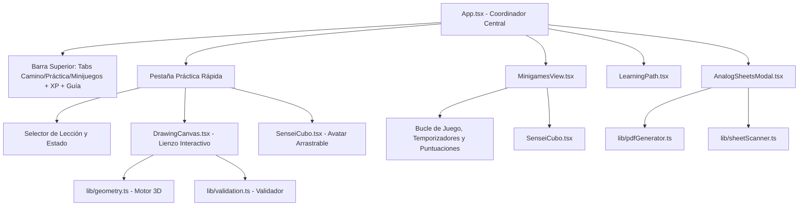

# 🏗️ Arquitectura Técnica y Estructura del Código

Este documento describe la arquitectura global de Paplitz, su árbol de componentes, la gestión de estado y el flujo de datos.

---

## 1. Visión General del Stack

- **Lenguaje**: TypeScript 5.7 (estricto).
- **Librería UI**: React 19 (`react`, `react-dom`).
- **Bundler & Dev Server**: Vite 6 con `@vitejs/plugin-react`.
- **Estilos**: Tailwind CSS v4 (utilidades compiladas a través de `@tailwindcss/vite`).
- **Iconografía**: `lucide-react`.
- **Avatar Engine**: `@bible-strong/avatar-core` + `@bible-strong/avatar-react` (motor procedural SVG).
- **Láminas & QR**: `jspdf` (generación de PDFs vectoriales), `qrcode` (renderizado de QR) y `jsqr` (decodificación por cámara).

---

## 2. Mapa de Directorios

```text
├── docs/                        # Documentación técnica para nuevos chats y ports
├── public/                      # Recursos estáticos servidos directamente
├── src/
│   ├── components/              # Componentes de la interfaz de usuario
│   │   ├── avatar/
│   │   │   ├── SenseiCubo.tsx   # Componente del compañero avatar arrastrable
│   │   │   └── avatarExpressions.tsx # Utilidades de expresiones
│   │   ├── AnalogSheetsModal.tsx# Modal para exportar PDFs y escanear por cámara
│   │   ├── DrawingCanvas.tsx    # Lienzo interactivo de dibujo con soporte de lápiz
│   │   ├── GuidebookModal.tsx   # Modal del libro guía teórico (principios de perspectiva)
│   │   ├── LearningPath.tsx     # Mapa pedagógico de niveles estilo Duolingo
│   │   ├── LevelGuideModal.tsx  # Guía de funcionamiento de niveles y exámenes
│   │   ├── MinigamesView.tsx    # Modos arcade: Fiebre, Blitz, Supervivencia, Sprint
│   │   └── ProfileView.tsx      # Estadísticas del usuario, XP y logros
│   ├── lib/                     # Motores lógicos puros (independientes de UI)
│   │   ├── avatarTypes.ts       # Tipos de estados de ánimo del avatar
│   │   ├── cubee.avatar.json    # Definición procedural de Cubee (avatar oficial)
│   │   ├── curriculumData.ts    # Estructura del currículo (8 unidades, 32+ lecciones)
│   │   ├── geometry.ts          # Motor de proyección 3D, cubos, ejes y sombras
│   │   ├── levelSystem.ts       # Algoritmos de XP, rangos y recompensas
│   │   ├── pdfGenerator.ts      # Generación de láminas A4 con retos y QR
│   │   ├── qrHelper.ts          # Codificación/decodificación compacta de retos en QR
│   │   ├── sheetScanner.ts      # Procesamiento de vídeo de webcam para leer QR
│   │   └── validation.ts        # Algoritmo de evaluación y puntuación de trazos
│   ├── App.tsx                  # Componente raíz y coordinador global de navegación
│   ├── index.css                # Estilos globales y temas Tailwind
│   └── main.tsx                 # Entrada principal React DOM
├── package.json
├── tsconfig.json
└── vite.config.ts
```

---

## 3. Componentes Clave y Jerarquía



### A. `App.tsx`
Es el orquestador principal:
- Mantiene el estado persistido o en memoria:
  - Pestaña activa (`activeTab`: `'practice'` | `'minigames'` | `'path'` | `'profile'`).
  - Nodo de lección activo (`activeNode`).
  - Progreso del currículo (nodos desbloqueados, completados, puntuaciones).
  - Puntos de experiencia (`xp`).
  - Reto actual generado (`challenge`).
  - Trazos dibujados (`strokes`).
  - Estado del avatar (`avatarMood`).
- Centrado del lienzo: Utiliza un layout `grid grid-cols-[1fr_auto_1fr]` para asegurar que el lienzo esté matemáticamente alineado con el centro de la pantalla, dejando a Cubito en la columna lateral derecha sin desplazar el centro.

### B. `DrawingCanvas.tsx`
- Gestiona el elemento `<canvas>` HTML5 con resolución nativa 600x540 y escala responsiva CSS.
- Escucha eventos de puntero (`PointerEvents`): ratón, pantalla táctil y lápiz óptico (`pen`).
- Renderizado por capas:
  1. Fondo y rejilla isométrica suave de apoyo.
  2. Ejes de coordenadas de proyección (X, Y, Z).
  3. Malla cuadrada de suelo (si la lección lo requiere, p. ej. en sombras).
  4. Foco de luz y rayos de construcción en retos de sombras.
  5. Aristas base del cubo (líneas negras sólidas predefinidas).
  6. Aristas dibujadas por el usuario (estilo boceto en tinta).
  7. Aristas de solución (líneas verdes punteadas cuando se pulsa "Solución").
- Barra de herramientas unificada: Botones *Deshacer*, *Borrar*, *Validar* y *Nuevo Cubo*.

### C. `SenseiCubo.tsx`
- Compañero interactivo basado en el motor de Bible Strong.
- Totalmente desacoplado del dibujo: se comunica mediante props (`mood`, `isDrawing`, `onPoke`).
- Incorpora física de arrastre directo a 60/120 FPS y caja de colisión para no invadir el lienzo ni tapar botones.

---

## 4. Gestión de Estado y Rendimiento

- **Sin dependencias pesadas de estado**: No se requiere Redux ni Zustand; el estado fluye limpiamente mediante props y callbacks React.
- **Rendimiento a 60/120 FPS**:
  - En el lienzo (`DrawingCanvas`), los trazos durante el dibujo activo se actualizan directamente sobre el contexto 2D sin provocar re-renderizados de la jerarquía React.
  - En el avatar (`SenseiCubo`), el arrastre del ratón aplica `translate3d` en el DOM con `setPointerCapture`, evitando ciclos de renderizado hasta que el usuario suelta el cursor.
