# 📐 Guía Maestra de Implementación: Deconstrucción y Adaptación Web del Cuaderno de Trazos y Tramado (42 Páginas) para Paplitz

> **Documento Técnico y Pedagógico para Paplitz**  
> **Autor / Arquitectura:** Antigravity AI & Lázaro Guerrero Losada  
> **Fecha:** Octubre 2026  
> **Estado:** Especificación de Producción & Prototipo Beta  
> **Aviso de Confidencialidad:** Este material y las imágenes de entrenamiento extraídas son estrictamente locales para el desarrollo del simulador. Nunca deben subirse a repositorios públicos ni distribuirse comercialmente.

---

## 📑 Índice General

1. [Visión y Filosofía Pedagógica en Paplitz](#1-visión-y-filosofía-pedagógica-en-paplitz)
2. [Hardware, Captura Web y Variables Físicas Medibles](#2-hardware-captura-web-y-variables-físicas-medibles)
3. [El Motor de Aleatoriedad Procedural (Anti-Memoria Muscular)](#3-el-motor-de-aleatoriedad-procedural-anti-memoria-muscular)
4. [Análisis Exhaustivo Página a Página (Págs 1 a 42)](#4-análisis-exhaustivo-página-a-página-págs-1-a-42)
   - *Bloque 1: Consistencia y Calistenia de Trazo (Págs 1 – 8)*
   - *Bloque 2: Trazos Fundamentales y Parámetros de Trama (Págs 9 – 13)*
   - *Bloque 3: Contornos Cruzados y Volumetría Orgánica (Págs 14 – 17)*
   - *Bloque 4: Control de Valor Tonal y Gradación (Págs 18 – 21)*
   - *Bloque 5: Planos, Facetas y Dirección de Trama (Págs 22 – 24)*
   - *Bloque 6: Sombreado de Bloques y Poliedros en 3 y 6 Valores (Págs 25 – 32)*
   - *Bloque 7: Sombreado de Superficies Curvas, Cilindros y Esferas (Págs 33 – 37)*
   - *Bloque 8: Composiciones de Sólidos, Valor Local y Formas Compuestas (Págs 38 – 42)*
5. [Matriz Comparativa de Viabilidad y Retos Técnicos](#5-matriz-comparativa-de-viabilidad-y-retos-técnicos)
6. [Arquitectura de Código en TypeScript para Paplitz](#6-arquitectura-de-código-en-typescript-para-paplitz)
7. [Propuesta de "El Camino de Trazado" (Curriculum Tree)](#7-propuesta-de-el-camino-de-trazado-curriculum-tree)
8. [Laboratorio Interactivo Beta (Demo Funcional en Web)](#8-laboratorio-interactivo-beta-demo-funcional-en-web)

---

## 1. Visión y Filosofía Pedagógica en Paplitz

Actualmente, **Paplitz** sobresale en la enseñanza analítica del espacio mediante **paralelepípedos y cajas en perspectiva**: el usuario aprende a proyectar hacia puntos de fuga distantes, calcular convergencias, visualizar el horizonte y trazar sombras arrojadas con focos $L$ y $L'$.

Sin embargo, el dibujo profesional a mano alzada (según autores canónicos como *Koos Eissen, Roselien Steur, Arthur Guptill y Scott Robertson*) se sustenta sobre dos pilares simbióticos:
1. **La Estructura Geométrica Espacial:** La capacidad mental de proyectar volumen, perspectiva y planos. (Lo que Paplitz ya enseña con maestría).
2. **El Control Neuromotor y la Caligrafía de la Línea:** La habilidad de la mano para ejecutar líneas rectas tensas sin titubeos, tramas paralelas equidistantes, gradaciones tonales homogéneas y curvas que "abrazan" el volumen en contornos cruzados (*cross-contours*).

Este cuaderno de 42 páginas de *Pen & Ink Drawing* es el eslabón perdido: enseña al cerebro y a la mano a dominar el **trazo repetitivo, la consistencia, el ritmo y la traducción de luz a valor tonal**.

### El Gran Reto en Web: De la Repetición Mecánica a la Destreza Real
En los cuadernos tradicionales en papel, el estudiante rellena filas idénticas de líneas verticales de 5 cm. Al cabo de 10 líneas, el estudiante ya no está corrigiendo su visión; simplemente está repitiendo un movimiento articular de la muñeca (memoria muscular fija). Si el ejercicio se le rota $35^\circ$ o se le pide que mida 12 cm, fracasa estrepitosamente.

**Nuestra solución en Paplitz:**
Al igual que el generador de cubos genera una caja única cada vez que se pulsa *"Nuevo Reto"* (cambiando los puntos de fuga, el ángulo de cámara y las coordenadas de inicio), **el motor de trazos de Paplitz generará dinámicamente retos paramétricos procedurales**. Cada intento presentará una inclinación, una longitud, una separación o una silueta 3D ligeramente diferente, forzando al usuario a calibrar su ojo y su propiocepción en cada trazo.

---

## 2. Hardware, Captura Web y Variables Físicas Medibles

Para saber si estos ejercicios son viables en un navegador web (tanto en desktop con ratón o tableta gráfica Wacom/Huion, como en tablets iPad con Apple Pencil o Android con S-Pen), debemos apoyarnos en el estándar del W3C: **`PointerEvent API`**.

### 2.1 Datos Brutos Proporcionados por el Navegador
Por cada punto registrado en el trazo del usuario capturamos:
* `x`, `y`: Coordenadas subpíxel en el sistema del canvas ($[0, W] \times [0, H]$).
* `timeStamp`: Marca de tiempo en milisegundos de alta resolución (`DOMHighResTimeStamp`).
* `pressure`: Fuerza de contacto en un rango de normalización $[0.0, 1.0]$. (En lápices ópticos es sensible a la presión; en ratones estándar es $0.5$ o $0.0$).
* `tiltX`, `tiltY`: Ángulo de inclinación del lápiz en grados $[-90^\circ, 90^\circ]$.
* `pointerType`: Tipo de transductor (`'pen'`, `'touch'`, `'mouse'`).

### 2.2 Variables Matemáticas Derivadas y Métricas de Rendimiento

A partir de esta serie temporal $S = \{(x_i, y_i, p_i, t_i)\}_{i=1}^M$, derivamos los siguientes parámetros de evaluación:

#### A. Rectitud / Curvatura Parásita ($\kappa$ y Desviación Perpendicular)
Para líneas rectas, unimos el punto inicial $P_1$ y el punto final $P_M$. Para cada punto intermedio $P_i$, calculamos la distancia euclídea perpendicular al segmento ideal:
$$d_\perp(P_i, \overline{P_1 P_M}) = \frac{|(P_M.y - P_1.y)P_i.x - (P_M.x - P_1.x)P_i.y + P_M.x P_1.y - P_M.y P_1.x|}{\sqrt{(P_M.x - P_1.x)^2 + (P_M.y - P_1.y)^2}}$$
* **Desviación Máxima:** $\Delta_{\max} = \max_i d_\perp(P_i)$.
* **Desviación Media:** $\bar{\Delta} = \frac{1}{M-2}\sum_{i=2}^{M-1} d_\perp(P_i)$.
* **Veredicto:** Si $\bar{\Delta} < 2.5\text{px}$, el trazo es perfectamente recto y firme.

#### B. Espaciado Interlineal y Ritmo (Pitch Consistency)
En tramas de líneas paralelas $S_1, S_2, \dots, S_N$, calculamos la distancia euclídea ortogonal entre trazos contiguos a lo largo de su eje transversal:
$$d_k = \text{distancia}(S_k, S_{k+1})$$
Calculamos la media $\mu_d$ y la varianza muestral $\sigma_d^2$:
$$\sigma_d = \sqrt{\frac{1}{N-1}\sum_{k=1}^{N-1} (d_k - \mu_d)^2}, \quad CV = \frac{\sigma_d}{\mu_d}$$
* Un Coeficiente de Variación $CV < 0.12$ ($12\%$) representa una precisión milimétrica humana sobresaliente.

#### C. Paralelismo y Dispersión Angular
Cada línea $S_k$ tiene un vector director $\vec{v}_k = (x_{M_k} - x_{1_k}, y_{M_k} - y_{1_k})$ y un ángulo $\theta_k = \operatorname{atan2}(v_y, v_x)$.
* Evaluamos la desviación respecto al ángulo promedio o al ángulo objetivo $\theta_{\text{target}}$:
$$\Delta\theta_k = \min(|\theta_k - \theta_{\text{target}}|, \pi - |\theta_k - \theta_{\text{target}}|)$$
* Una dispersión $\sigma_\theta < 3.5^\circ$ garantiza un paralelismo estético impecable.

#### D. Dinámica del Remate / Desvanecimiento ("Trailing Lines / Flicks")
En ejercicios de sombreado con "pluma que despega" (Página 7 y 8):
* Calculamos la velocidad instantánea al inicio, centro y final: $v(t) = \frac{\sqrt{\Delta x^2 + \Delta y^2}}{\Delta t}$.
* Medimos la aceleración terminal: Si $\frac{dv}{dt} > 0$ y la presión $p \to 0$ al final del trazo, el usuario ha ejecutado un *flick* (desvanecimiento aéreo) auténtico en lugar de frenar bruscamente con una gota/punto de tinta.

#### E. Densidad Óptica Tonal (Valor Escala 0 a 5)
Para ejercicios de sombreado de planos o caras poliédricas:
En un canvas fuera de pantalla (*OffscreenCanvas*) con la máscara del polígono $A$:
$$\text{Densidad Óptica } \rho = \frac{\text{Píxeles negros entintados dentro de } A}{\text{Área total de píxeles dentro de } A} \in [0.0, 1.0]$$
Mapeamos $\rho$ a una escala estándar de 6 valores artísticos:
* **Valor 0 (Blanco / Luz Máxima):** $\rho < 0.03$ ($<3\%$)
* **Valor 1 (Medio-tono Claro):** $\rho \in [0.08, 0.16]$
* **Valor 2 (Medio-tono):** $\rho \in [0.18, 0.30]$
* **Valor 3 (Sombra Media):** $\rho \in [0.32, 0.48]$
* **Valor 4 (Sombra Profunda):** $\rho \in [0.50, 0.68]$
* **Valor 5 (Oscuridad Máxima):** $\rho > 0.70$

---

## 3. El Motor de Aleatoriedad Procedural (Anti-Memoria Muscular)

Para evitar que el usuario mecanice el trazo como un robot en un solo ángulo cómodo (típicamente de arriba a abajo con inclinación de $15^\circ$ para diestros):

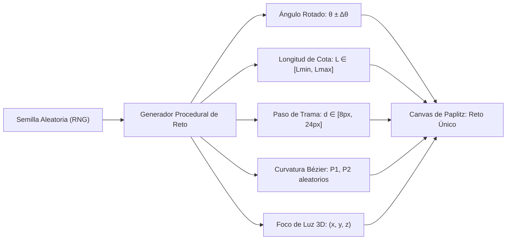
```mermaid
flowchart LR
    Seed["Semilla Aleatoria (RNG)"] --> Engine["Generador Procedural de Reto"]
    Engine --> Var1["Ángulo Rotado: &theta; &plusmn; &Delta;&theta;"]
    Engine --> Var2["Longitud de Cota: L &isin; [Lmin, Lmax]"]
    Engine --> Var3["Paso de Trama: d &isin; [8px, 24px]"]
    Engine --> Var4["Curvatura B&eacute;zier: P1, P2 aleatorios"]
    Engine --> Var5["Foco de Luz 3D: (x, y, z)"]
    Var1 & Var2 & Var3 & Var4 & Var5 --> Canvas["Canvas de Paplitz: Reto Único"]
```

1. **Rotación Aleatoria del Espacio de Trabajo:** Cada ejercicio de líneas rectas o zigzags genera un vector director aleatorio $\theta \in [0^\circ, 360^\circ]$. El usuario puede girar el lienzo digital con un gesto de dos dedos (o mantenerlo fijo para forzar la muñeca/antebrazo a dibujar en ángulos incómodos).
2. **Variabilidad en Longitud de Trazado:** Los límites de las líneas de cota se calculan proceduralmente entre 50px y 250px.
3. **Mallas Poligonales y Bloques 3D Paramétricos:** En los ejercicios de sombreado (Págs 25 a 32), la posición del foco solar central y las dimensiones de los prismas cambian con cada semilla, obligando al usuario a calcular de verdad el producto escalar $\vec{n} \cdot \vec{L}$ de cada plano.

---

## 4. Análisis Exhaustivo Página a Página (Págs 1 a 42)

A continuación se desglosan las **42 páginas del cuaderno original**, analizando su propósito, viabilidad web, métricas de código, parámetros aleatorios y su diseño de nivel para Paplitz.

---

### 🟢 BLOQUE 1: CONSISTENCIA Y CALISTENIA DE TRAZO (PÁGS 1 A 8)

#### Página 1 — Ejercicio 1.1: Consistency (Making Strokes Consistent)
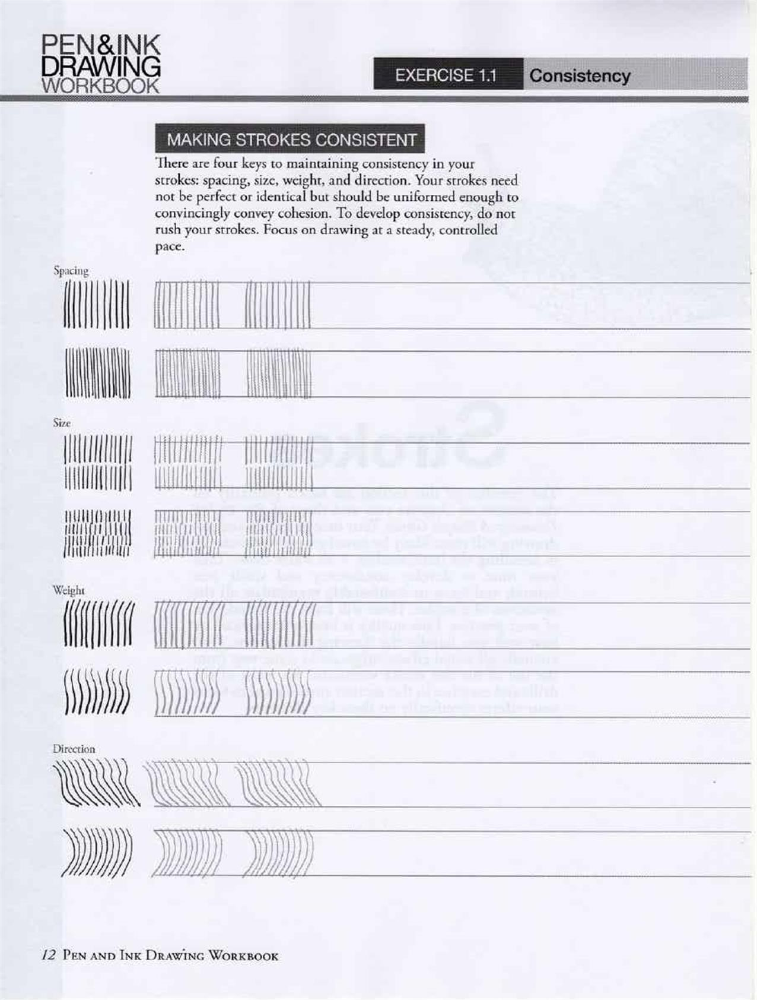
* **Contenido Original:** Cuatro filas de entrenamiento de líneas paralelas: 1) Espaciado uniforme, 2) Longitud uniforme entre líneas de guía, 3) Peso/grosor uniforme, 4) Dirección y paralelismo en líneas inclinadas.
* **Propósito Pedagógico:** Enseñar al estudiante que un sombreado convincente no requiere perfección fotográfica, sino consistencia rítmica en cuatro factores clave: *spacing, size, weight, direction*.
* **¿Es viable en Web?:** **SÍ (100% Viable)**. Es el ejercicio fundacional ideal para la web.
* **Variables a medir:**
  1. $\sigma_{\text{spacing}}$: Desviación estándar de la distancia entre trazos consecutivos.
  2. $\Delta L$: Error porcentual de la longitud de cada línea respecto al carril guía superior e inferior.
  3. $\Delta\theta$: Varianza angular entre trazos adyacentes.
  4. $\sigma_p$: Desviación estándar de presión (o grosor de línea si se usa stylus).
* **Fórmula de Puntuación:**
  $$\text{Score} = 100 - 30\left(\frac{\sigma_{\text{spacing}}}{\bar{d}}\right) - 30\left(\frac{\bar{\Delta L}}{L_{\text{target}}}\right) - 25\left(\frac{\sigma_\theta}{10^\circ}\right) - 15(\text{curvatura})$$
* **Aleatoriedad Procedural:** En cada partida, se aleatoriza:
  * El ángulo de inclinación del carril ($\theta \in [45^\circ, 135^\circ]$).
  * La separación objetivo entre líneas (ej. reto a 8px vs reto a 16px).
  * La altura del carril ($L \in [60\text{px}, 180\text{px}]$).
* **Nivel Paplitz propuesto:** **Nivel 1.1 — "El Metrónomo de Tinta"** (Tipo: *Warmup* | Dificultad: *Fácil*).

---

#### Página 2 — Ejercicio 1.2: Consistency across Contour Outlines
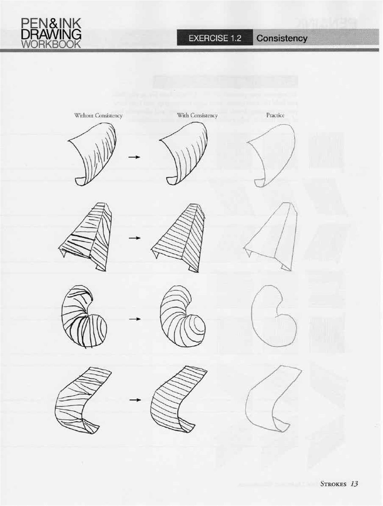
* **Contenido Original:** Cuatro siluetas cerradas (cinta ondeante, prisma cónico, caracol/espiral, banda curvada). Muestra cómo se arruina el dibujo sin consistencia y cómo cobra volumen cuando las líneas siguen la curvatura y mantienen espaciado regular.
* **Propósito Pedagógico:** Aplicar la consistencia de trazo a contornos no paralelos donde la longitud de cada línea varía de forma continua.
* **¿Es viable en Web?:** **SÍ (100% Viable)**.
* **Variables a medir:**
  1. Anclaje en bordes: Los extremos inicial y final del trazo deben nacer y morir sobre el contorno del objeto ($\text{distancia} \le 5\text{px}$).
  2. Progresión suave de curvatura: Las líneas intermedias deben interpolar armónicamente entre la curvatura del borde de entrada y el de salida.
  3. Densidad armónica transversal: El espaciado no debe agruparse bruscamente en un punto.
* **Aleatoriedad Procedural:** Generación de siluetas orgánicas 2D mediante curvas Bézier cúbicas con vértices modulados por funciones trigonométricas aleatorias.
* **Nivel Paplitz propuesto:** **Nivel 1.2 — "La Cinta Volumétrica"** (Tipo: *Standard* | Dificultad: *Media*).

---

#### Página 3 — Ejercicio 1.3: Pen Control — Straight Lines
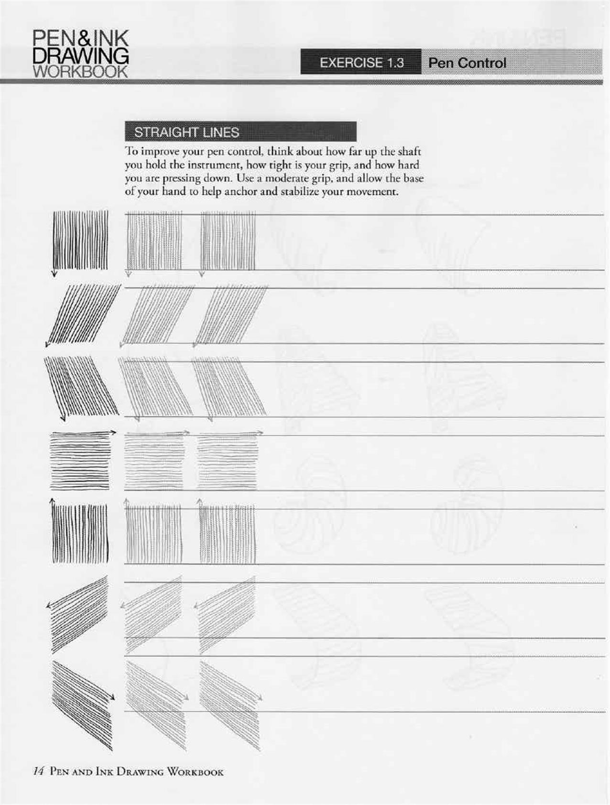
* **Contenido Original:** Trazado de líneas rectas en los 8 cuadrantes espaciales: vertical descendente, diagonal $45^\circ$ abajo-derecha, diagonal abajo-izquierda, horizontal derecha, vertical ascendente, diagonal arriba-derecha, diagonal arriba-izquierda, y diagonal larga.
* **Propósito Pedagógico:** Aprender a bloquear la muñeca y utilizar el codo y el hombro como pivote, identificando los ángulos ciegos de la mano.
* **¿Es viable en Web?:** **SÍ (100% Viable)**.
* **Variables a medir:**
  1. Rectitud del trazo (sagita y desviación ortogonal respecto al segmento euclídeo).
  2. Alineación con el vector director de la flecha objetivo ($\Delta\theta = |\theta_{\text{real}} - \theta_{\text{meta}}|$).
  3. Suavidad / Temblor (*Jitter Index*): Detección de micro-oscilaciones de alta frecuencia causadas por tensión excesiva de los dedos.
* **Aleatoriedad Procedural:** Generación aleatoria de puntos de origen y dianas objetivo en posiciones angulares variables de $0^\circ$ a $360^\circ$.
* **Nivel Paplitz propuesto:** **Nivel 1.3 — "La Brújula de Trazos Rectos"** (Tipo: *Standard* | Dificultad: *Media*).

---

#### Página 4 — Ejercicio 1.4: Pen Control — Angles & Zigzags
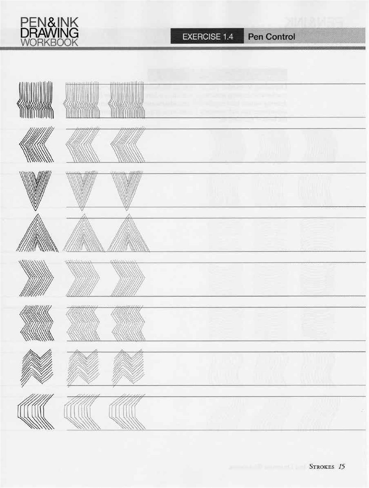
* **Contenido Original:** Patrones con quiebros angulares secos: bayonetas verticales (escalón central), chevrones izquierdos (`<<<`), vértices en V, vértices en punta (tienda de campaña `^^^`), chevrones derechos (`>>>`), zigzag triple, relámpagos (`Z/N`) y bandas en chevron.
* **Propósito Pedagógico:** Desarrollar el freno cinético: cambiar de dirección en seco en un vértice afilado sin redondear la esquina ni levantar el bolígrafo.
* **¿Es viable en Web?:** **SÍ (100% Viable)**.
* **Variables a medir:**
  1. Radio de curvatura del vértice: Un quiebro perfecto tiene un radio de curvatura en la esquina $R \to 0\text{px}$ (esquina nítida, no redondeada).
  2. Alineación de las cúspides: Los vértices deben descansar alineados sobre el eje de simetría de la figura.
  3. Rectitud de las ramas previa y posterior al vértice.
* **Aleatoriedad Procedural:** Ángulo de apertura de los chevrones ($\alpha \in [45^\circ, 120^\circ]$) y número de segmentos variables por patrón.
* **Nivel Paplitz propuesto:** **Nivel 1.4 — "Quiebro y Esquina"** (Tipo: *Rush* | Dificultad: *Media*).

---

#### Página 5 — Ejercicio 1.5: Pen Control — Curved Lines
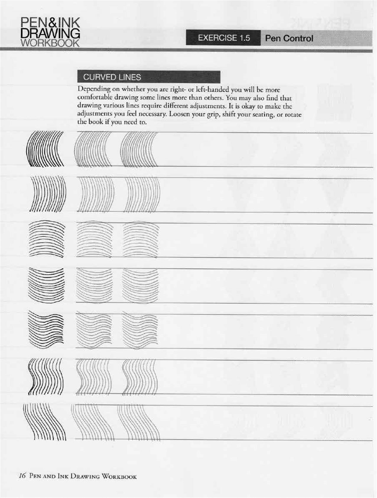
* **Contenido Original:** Trazos curvos puros: arcos en C convexos hacia la derecha, arcos hacia la izquierda, bóvedas convexas hacia arriba, curvas sonrientes hacia abajo, curvas en S sinusoidales horizontales, curvas en S verticales y abanicos de curvas divergentes.
* **Propósito Pedagógico:** Dominar la aceleración suave del trazo curvo sin que la línea se quiebre en facetas rectas.
* **¿Es viable en Web?:** **SÍ (100% Viable)**.
* **Variables a medir:**
  1. Continuidad de curvatura $C^2$: El signo de la segunda derivada $\frac{d^2 y}{dx^2}$ debe ser constante en curvas en C (sin inflexiones accidentales), y debe tener exactamente una única inflexión en curvas en S.
  2. Ajuste a la curva generatriz (distancia de Fréchet respecto a una curva Bézier paramétrica diana).
  3. Equidistancia constante a lo largo de toda la longitud del arco.
* **Aleatoriedad Procedural:** Amplitud sinusoidal $A$, longitud de onda $\lambda$, radio de curvatura $R$ y orientación angular del eje de la onda.
* **Nivel Paplitz propuesto:** **Nivel 1.5 — "Ondas y Arcos Suaves"** (Tipo: *Standard* | Dificultad: *Media*).

---

#### Página 6 — Ejercicio 1.6: Pen Control — Radial & Complex Organic Strokes
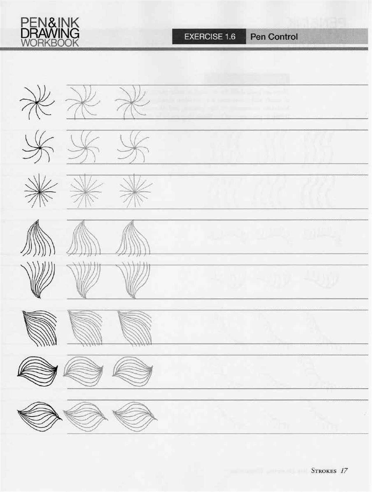
* **Contenido Original:** Molinetes radiales en espiral (sentido horario y antihorario), estrella de radios rectos divergentes desde un núcleo común, llamas/gotas confluentes, haces de plumas y ojos/semillas concéntricos.
* **Propósito Pedagógico:** Controlar la convergencia y divergencia radial de trazos desde un foco común sin apelmazar el centro.
* **¿Es viable en Web?:** **SÍ (100% Viable)**.
* **Variables a medir:**
  1. Confluencia en el foco: Las prolongaciones de las líneas deben cruzar el punto central $(x_0, y_0)$ con un margen de tolerancia $\epsilon \le 6\text{px}$.
  2. Distribución angular uniforme: $\Delta\theta_i \approx \frac{2\pi}{N}$.
* **Aleatoriedad Procedural:** Posición del núcleo central, cantidad de radios $N \in [8, 20]$ y factor de curvatura espiral.
* **Nivel Paplitz propuesto:** **Nivel 1.6 — "Molinetes y Convergencias"** (Tipo: *Standard* | Dificultad: *Difícil*).

---

#### Página 7 — Ejercicio 1.7: Pen Control — Trailing Lines (Flicks & Shading Hooks)
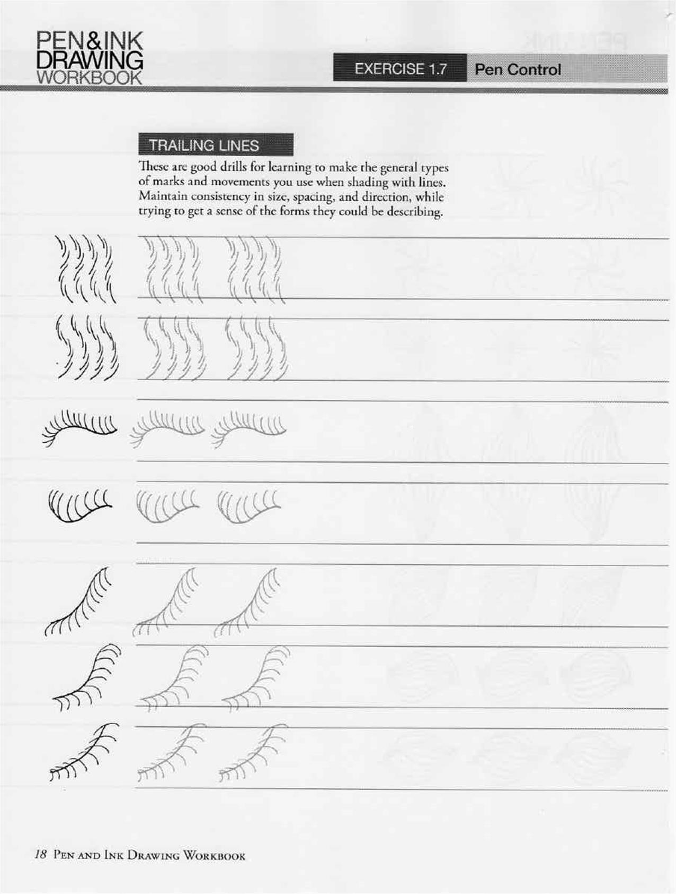
* **Contenido Original:** Líneas de sombreado con escape ("flicks"): trazos verticales que se van desvaneciendo en la punta, pestañas sobre línea horizontal, costillas de pluma sobre espina curvada.
* **Propósito Pedagógico:** Enseñar el gesto de soltar gradualmente la presión al final del trazo para que la línea muera en una aguja afilada y no en un punto grueso.
* **¿Es viable en Web?:** **SÍ (100% Viable)**. En dispositivos con lápiz óptico se mide la presión decreciente; con ratón se mide la aceleración cinemática de despegue.
* **Variables a medir:**
  1. Perfil de velocidad: $v_{\text{final}} > v_{\text{media}}$ (aceleración de despegue).
  2. Perfil de presión: $p_{\text{final}} \to 0$.
  3. Ángulo de inserción respecto al raquis/espina curvada.
* **Aleatoriedad Procedural:** Trayectoria procedural de la espina dorsal y longitud variable de las cerdas.
* **Nivel Paplitz propuesto:** **Nivel 1.7 — "Plumas y Desvanecidos"** (Tipo: *Standard* | Dificultad: *Difícil*).

---

#### Página 8 — Ejercicio 1.8: Pen Control — Advanced Spines & Contours
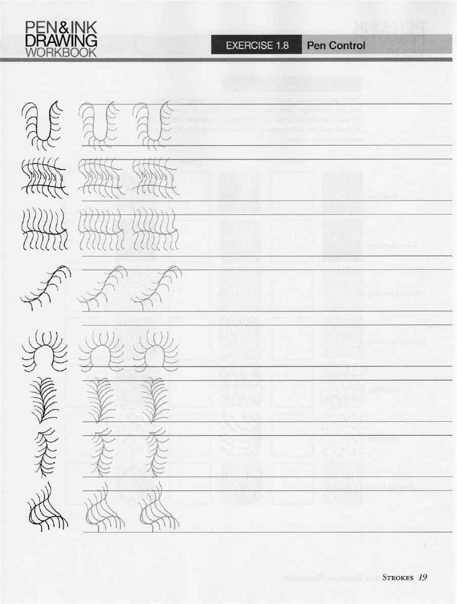
* **Contenido Original:** Espinas complejas: tubos en U con cerdas externas, cintas onduladas cruzadas, tallos en arco de herradura, oruga segmentada y espina de pez simétrica.
* **Propósito Pedagógico:** Mantener la orientación normal ortogonal ($\vec{n}$) a lo largo de una curva de contorno variable.
* **¿Es viable en Web?:** **SÍ (100% Viable)**.
* **Variables a medir:**
  1. Perpendicularidad dinámica: El trazo debe formar un ángulo de $90^\circ \pm 15^\circ$ con el vector tangente $\vec{t}(s)$ de la espina guía.
* **Aleatoriedad Procedural:** Curvatura de la espina paramétrica generada con Splines de Catmull-Rom.
* **Nivel Paplitz propuesto:** **Nivel 1.8 — "El Examen de Calistenia"** (Tipo: *Exam* | Dificultad: *Difícil*).

---

### 🟣 BLOQUE 2: TRAZOS FUNDAMENTALES Y PARÁMETROS DE TRAMA (PÁGS 9 A 13)

#### Página 9 — Ejercicio 1.9: The Basic Strokes (Los 7 Trazos Fundamentales)
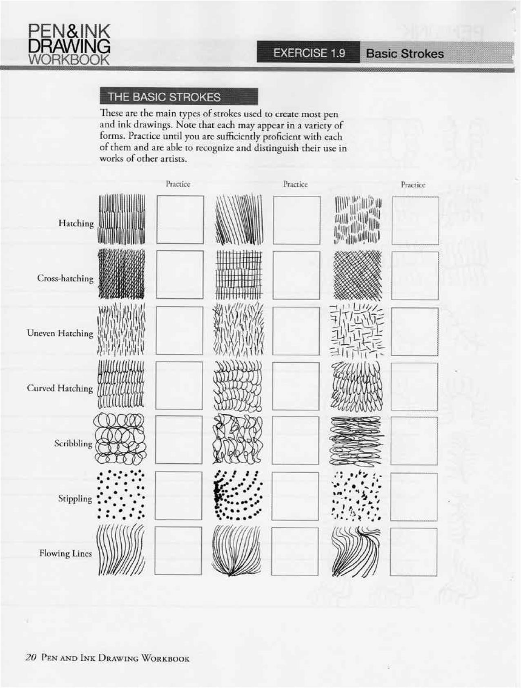
* **Contenido Original:** Los 7 estilos de trazo en cuadrículas cuadradas:
  1. *Hatching* (Trama paralela recta).
  2. *Cross-hatching* (Trama cruzada bidireccional).
  3. *Uneven Hatching* (Trama discontinua / césped / pelo).
  4. *Curved Hatching* (Trama curvada / tejas).
  5. *Scribbling* (Garabato continuo ochentero / lazos).
  6. *Stippling* (Puntillismo de densidad variable).
  7. *Flowing Lines* (Líneas ondulantes paralelas).
* **Propósito Pedagógico:** Familiarizar al dibujante con el repertorio expresivo de tintas.
* **¿Es viable en Web?:** **SÍ (100% Viable)**.
* **Variables a medir:**
  1. Clasificación del estilo (detección automática de puntos vs líneas vs lazos continuos).
  2. Confinamiento perimetral: Las marcas no deben desbordar el marco cuadrado asignado.
  3. Cobertura de superficie (densidad objetivo).
* **Aleatoriedad Procedural:** Asignación aleatoria de cajas objetivo con densidades tonales requeridas ($20\%$, $40\%$, $60\%$).
* **Nivel Paplitz propuesto:** **Nivel 2.1 — "Los 7 Maestros de la Tinta"** (Tipo: *Standard* | Dificultad: *Fácil*).

---

#### Página 10 — Ejercicio 1.10: Basic Strokes Variations
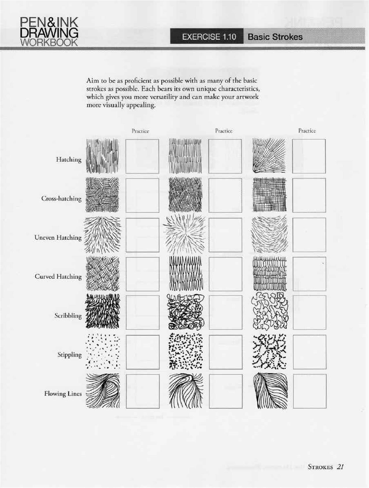
* **Contenido Original:** Variaciones avanzadas de las 7 técnicas: trama en abanico radiante, trama cruzada en diamante fino, pelaje arremolinado, garabato cerrado tipo rompecabezas, nubes de puntillismo con gradiente, melenas fluidas.
* **Propósito Pedagógico:** Explorar texturas de micro-contraste y volumen mediante la combinación de variables.
* **¿Es viable en Web?:** **SÍ (100% Viable)**.
* **Variables a medir:**
  1. Homogeneidad de textura local (entropía espacial en matriz de coocurrencia de niveles de gris).
  2. Distribución de longitud de segmento.
* **Aleatoriedad Procedural:** Dimensiones del marco y semilla de gradiente.
* **Nivel Paplitz propuesto:** **Nivel 2.2 — "El Taller de Texturas"** (Tipo: *Standard* | Dificultad: *Media*).

---

#### Página 11 — Ejercicio 1.11: Stroke Variations — Hatching Parameters
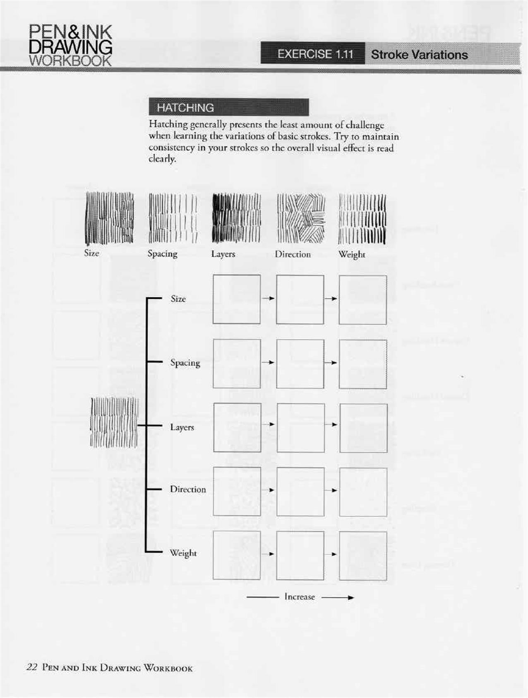
* **Contenido Original:** Matriz de control paramétrico de la trama recta aislada en 5 variables: *Size* (longitud), *Spacing* (paso), *Layers* (capas), *Direction* (ángulo) y *Weight* (grosor).
* **Propósito Pedagógico:** Enseñar al estudiante a alterar conscientemente un parámetro sin alterar los demás de forma accidental.
* **¿Es viable en Web?:** **SÍ (100% Viable)**.
* **Variables a medir:**
  * Escalado incremental: Si el paso 1 pide separación ancha ($20\text{px}$) y el paso 2 separación estrecha ($8\text{px}$), el algoritmo verifica el gradiente diferencial entre celdas contiguas: $\bar{d}_2 < \bar{d}_1$.
* **Aleatoriedad Procedural:** Objetivos numéricos dinámicos generados por reto (ej: "Dibuja a 15px de paso; ahora al doble de densidad").
* **Nivel Paplitz propuesto:** **Nivel 2.3 — "Laboratorio de Trama Paralela"** (Tipo: *Standard* | Dificultad: *Media*).

---

#### Página 12 — Ejercicio 1.12: Stroke Variations — Cross-Hatching Parameters
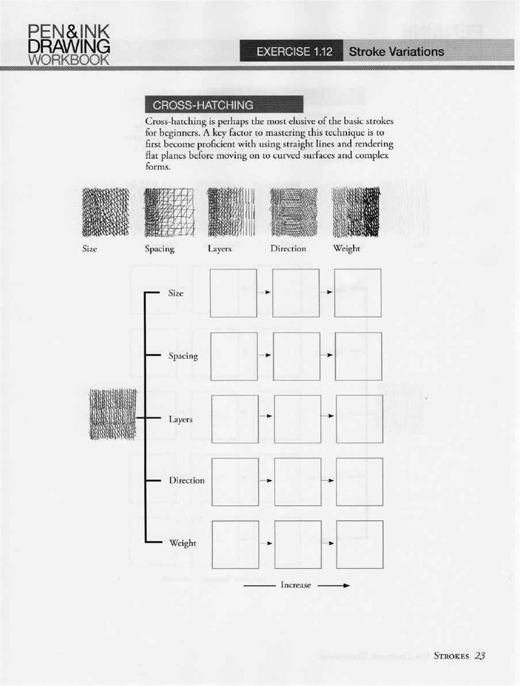
* **Contenido Original:** Control paramétrico del *Cross-Hatching*: Tamaño de malla, Espaciado, Capas (2, 3 o 4 pasadas en ángulos distintos), Dirección (ortogonal a $90^\circ$ vs romboidal a $45^\circ$) y Grosor.
* **Propósito Pedagógico:** Evitar que el rayado cruzado forme un tablero de ajedrez tosco; lograr mallas geométricas finas y homogéneas.
* **¿Es viable en Web?:** **SÍ (100% Viable)**.
* **Variables a medir:**
  1. Ángulo de cruce entre familias de trazos: $\Delta\theta = |\theta_{\text{capa 2}} - \theta_{\text{capa 1}}| \approx 45^\circ$ o $90^\circ$.
  2. Densidad de nodos de intersección por centímetro cuadrado.
* **Aleatoriedad Procedural:** Ángulos primarios y secundarios seleccionados al azar.
* **Nivel Paplitz propuesto:** **Nivel 2.4 — "El Tejido de Mallas"** (Tipo: *Standard* | Dificultad: *Difícil*).

---

#### Página 13 — Ejercicio 1.13: Stroke Variations — Uneven Hatching Parameters
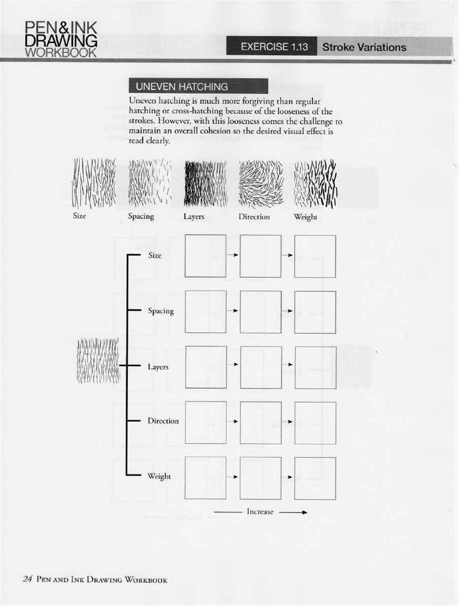
* **Contenido Original:** Trama irregular/discontinua: trazos cortos traslapados para texturas naturales (corteza de árbol, pelaje, ropa de lana), modulando Tamaño, Espaciado, Capas, Dirección y Grosor.
* **Propósito Pedagógico:** Lograr textura orgánica sin que los trazos se alineen accidentalmente formando costuras o rayas visibles indeseadas.
* **¿Es viable en Web?:** **SÍ (100% Viable)**.
* **Variables a medir:**
  1. Desfasamiento de extremos: Los inicios y finales de los trazos deben tener una distribución uniforme en el plano (baja autocorrelación espacial).
* **Aleatoriedad Procedural:** Densidad de población de trazos y longitud media requerida.
* **Nivel Paplitz propuesto:** **Nivel 2.5 — "Corteza y Pelaje Orgánico"** (Tipo: *Standard* | Dificultad: *Media*).

---

### 🟡 BLOQUE 3: CONTORNOS CRUZADOS Y VOLUMETRÍA ORGÁNICA (PÁGS 14 A 17)

#### Página 14 — Ejercicio 2.5: Cross-Contour Lines
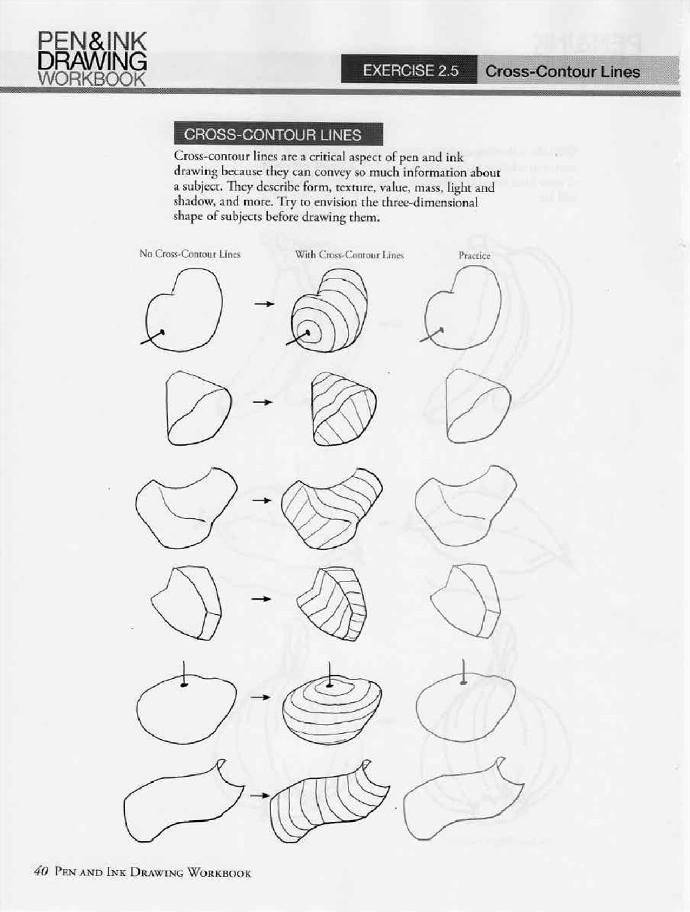
* **Contenido Original:** Formas 3D icónicas (pera/gota con eje, canto rodado biselado, alubia/cacahuete, roca facetada, manzana con rabillo, cinta alabeada). Muestra la forma vacía plana y cómo las líneas de contorno transversal revelan inmediatamente la tridimensionalidad.
* **Propósito Pedagógico:** Comprender que las líneas en dibujo no son solo bordes 2D, sino curvas de nivel espaciales que describen la topografía de una superficie en el espacio tridimensional.
* **¿Es viable en Web?:** **SÍ (100% Viable)**. Extremadamente afín al ADN de perspectiva de Paplitz.
* **Variables a medir:**
  1. Curvatura volumétrica coherente: Las elipses o arcos deben curvarse en la dirección de la normal del volumen.
  2. Enlace en el perímetro: Cada línea debe originarse en un borde de la silueta y terminar en el borde opuesto sin flotar en el aire.
  3. Deformación en perspectiva: Las secciones más cercanas al observador deben abrirse más que las lejanas.
* **Aleatoriedad Procedural:** Generación de sólidos 3D procedurales mediante superficies de revolución o barrido de splines.
* **Nivel Paplitz propuesto:** **Nivel 3.1 — "El Alambre Volumétrico"** (Tipo: *Standard* | Dificultad: *Media*).

---

#### Página 15 — Ejercicio 2.6: Cross-Contour Lines on Freeform Silhouettes
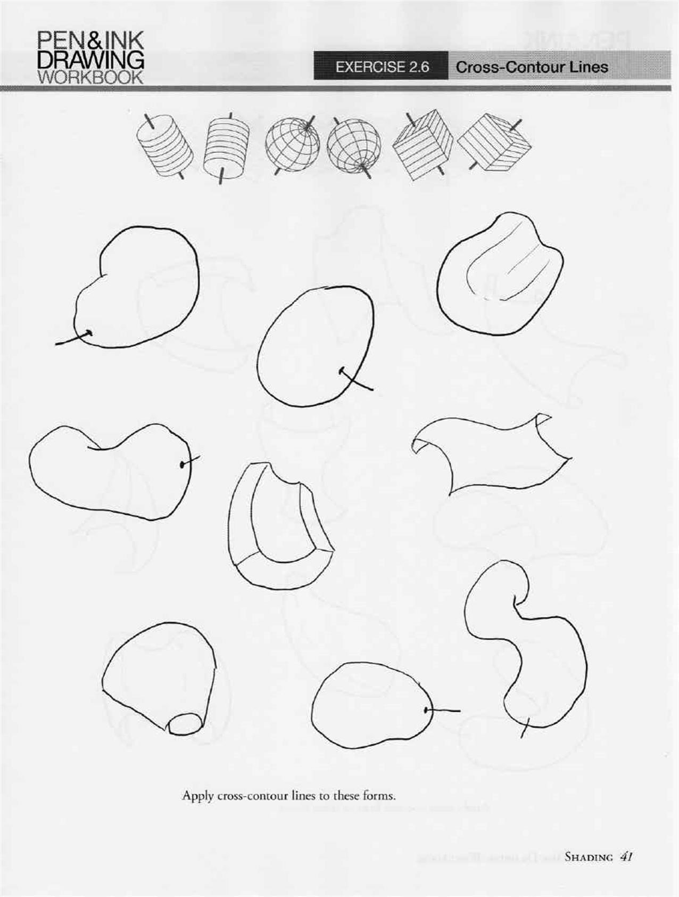
* **Contenido Original:** 8 siluetas orgánicas arbitrarias (gotas, tubos, bolsas, cuñas), cada una atravesada por una varilla o eje rector con una flecha. Arriba se muestran cilindros, esferas y cajas con su varilla como referencia explicativa.
* **Propósito Pedagógico:** Enseñar a identificar el eje central de cualquier masa orgánica y construir secciones perpendiculares a ese eje para dotarla de masa y orientación espacial.
* **¿Es viable en Web?:** **SÍ (100% Viable)**.
* **Variables a medir:**
  1. Perpendicularidad transversal al eje rector local: $\vec{v}_{\text{trazo}} \perp \vec{t}_{\text{eje}}$.
  2. Ajuste al contorno perimetral.
* **Aleatoriedad Procedural:** Generador de blobs mediante perturbaciones armónicas de Fourier sobre el radio polar de una elipse: $r(\theta) = R_0 + \sum a_k \cos(k\theta + \phi_k)$, con un eje 3D aleatorio.
* **Nivel Paplitz propuesto:** **Nivel 3.2 — "El Eje Rector del Volumen"** (Tipo: *Standard* | Dificultad: *Media*).

---

#### Página 16 — Ejercicio 2.7: Cross-Contour Lines — Curved Sheets & Hollow Shells
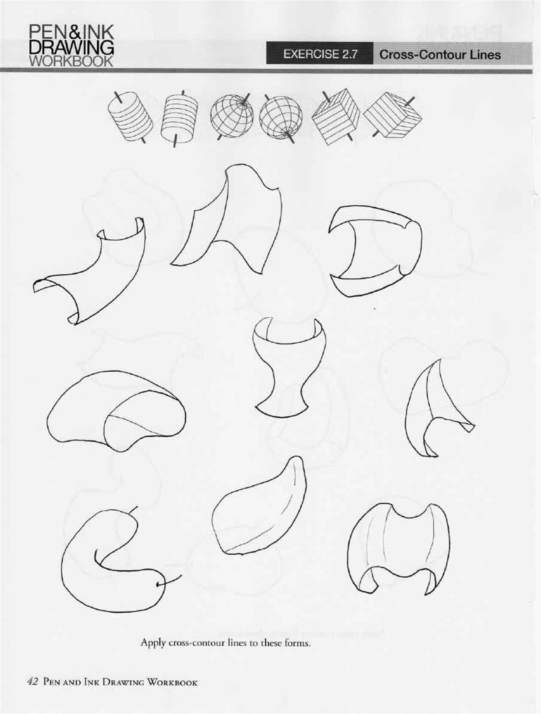
* **Contenido Original:** Láminas alabeadas abiertas, canalones, sillas de montar, collarines cilíndricos, cúpulas de tortuga, cuernos cónicos y cuencos cóncavos.
* **Propósito Pedagógico:** Diferenciar superficies regladas convexas de superficies cóncavas mediante la dirección de la curvatura del trazo.
* **¿Es viable en Web?:** **SÍ (100% Viable)**.
* **Variables a medir:**
  1. Coherencia cóncavo/convexo: Verificar que la orientación del arco coincida con la apertura del hueco.
* **Aleatoriedad Procedural:** Generación de superficies cilíndricas y cónicas alabeadas con parámetros de torsión aleatorios.
* **Nivel Paplitz propuesto:** **Nivel 3.3 — "Conchas y Canalones Curvos"** (Tipo: *Standard* | Dificultad: *Difícil*).

---

#### Página 17 — Ejercicio 2.8: Cross-Contour Lines — Advanced Twisted Forms

* **Contenido Original:** Cintas dobladas en acordeón, tubos torcidos en U con puntas de flecha, salchichas en S, cojines hinchados con hendidura central, rocas facetadas y chapas onduladas.
* **Propósito Pedagógico:** Tratar torsiones complejas donde el eje central gira en tres dimensiones en el espacio.
* **¿Es viable en Web?:** **SÍ (100% Viable)**.
* **Variables a medir:**
  1. Interpolación de secciones transversales a lo largo de una spline 3D con torsión (*Frenet-Serret Frame*).
* **Aleatoriedad Procedural:** Curvas B-Spline 3D proyectadas en perspectiva con rotación arbitraria.
* **Nivel Paplitz propuesto:** **Nivel 3.4 — "Torsiones y Pliegues Espaciales"** (Tipo: *Exam* | Dificultad: *Difícil*).

---

### 🟠 BLOQUE 4: CONTROL DE VALOR TONAL Y GRADACIÓN (PÁGS 18 A 21)

#### Página 18 — Ejercicio 2.9: Creating Even Value (El Valor Plano Homogéneo)
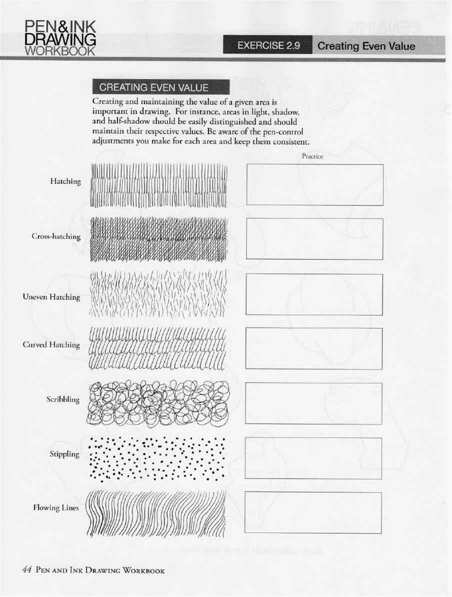
* **Contenido Original:** 7 franjas rectangulares alargadas. En cada una se debe aplicar una de las 7 técnicas básicas para producir un tono uniforme de principio a fin, sin zonas más claras ni más oscuras.
* **Propósito Pedagógico:** Entender que para sombrear una cara plana en luz o en sombra propia, el valor debe mantenerse estrictamente uniforme y constante en toda su superficie.
* **¿Es viable en Web?:** **SÍ (100% Viable)**.
* **Variables a medir:**
  1. Varianza espacial de densidad: Subdividimos el rectángulo en 10 franjas verticales y calculamos la densidad de tinta en cada una. La varianza $\sigma^2(\rho_1, \dots, \rho_{10})$ debe ser prácticamente cero.
  2. Ajuste al valor objetivo asignado (ej. $35\%$).
* **Aleatoriedad Procedural:** Tono diana asignado al azar para cada rectángulo.
* **Nivel Paplitz propuesto:** **Nivel 4.1 — "El Tono Plano Perfecto"** (Tipo: *Standard* | Dificultad: *Media*).

---

#### Página 19 — Ejercicio 2.10: Creating Even Value — Topographical Map
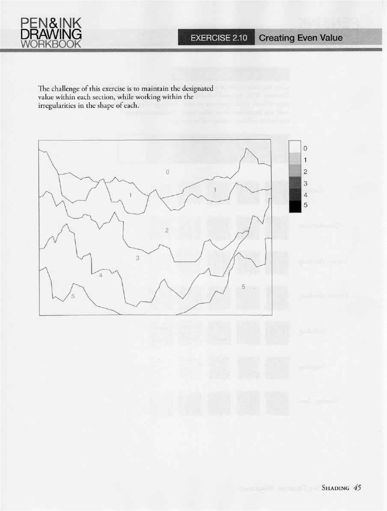
* **Contenido Original:** Un marco rectangular dividido en estratos/curvas de nivel irregulares numeradas de 0 a 5. El reto consiste en mantener el valor uniforme exacto en cada sección sin rebasar los bordes quebrados.
* **Propósito Pedagógico:** Mantener la homogeneidad de trama dentro de regiones geométricas arbitrarias y angostas.
* **¿Es viable en Web?:** **SÍ (100% Viable)**.
* **Variables a medir:**
  1. Monotonía tonal de estratos: $\rho(\text{Región } 0) < \rho(1) < \rho(2) < \rho(3) < \rho(4) < \rho(5)$.
  2. Sangrado de bordes: Trazos que cruzan la frontera divisoria hacia la región contigua.
* **Aleatoriedad Procedural:** Generación de franjas orográficas con ruido Perlin / Simplex procedimental.
* **Nivel Paplitz propuesto:** **Nivel 4.2 — "El Mapa Topográfico de Tinta"** (Tipo: *Standard* | Dificultad: *Media*).

---

#### Página 20 — Ejercicio 2.19: Direction of Gradation
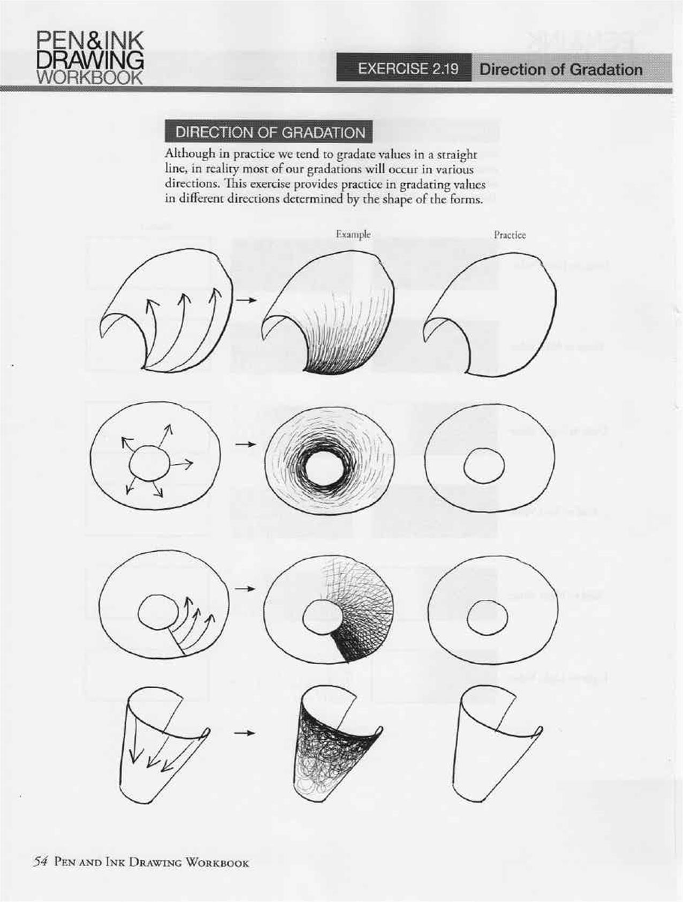
* **Contenido Original:** Formas curvas con gradiente direccionado: pétalo curvo (gradación a lo largo del tallo hacia la punta), dónut/toroide (gradación radial centrífuga desde el hueco), collarín circular y rampa doblada con gradación descendente.
* **Propósito Pedagógico:** Aprender que las sombras en objetos curvos no son estáticas ni rectas, sino que fluyen en la dirección dictada por la curvatura del cuerpo.
* **¿Es viable en Web?:** **SÍ (100% Viable)**.
* **Variables a medir:**
  1. Alineación del gradiente óptico $\nabla \rho(x, y)$ con el campo vectorial objetivo $\vec{D}(x, y)$ indicado por las flechas.
  2. Suavidad del degradado (ausencia de escalones bruscos).
* **Aleatoriedad Procedural:** Ángulo de inicio y vector director del gradiente.
* **Nivel Paplitz propuesto:** **Nivel 4.3 — "El Flujo de la Sombra"** (Tipo: *Standard* | Dificultad: *Difícil*).

---

#### Página 21 — Ejercicio 2.20: Direction of Gradation (Formas Complejas)
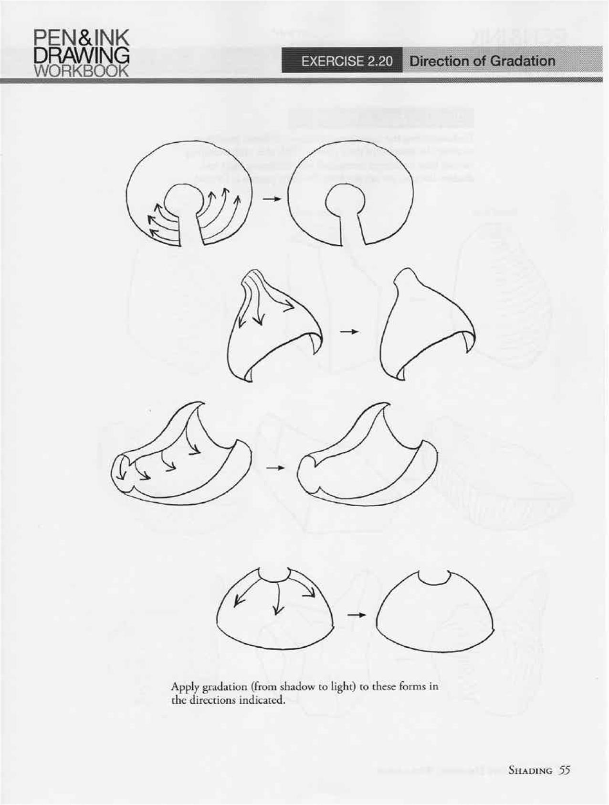
* **Contenido Original:** Cuatro geometrías complejas adicionales: collar en C abierto, cúpula campaniforme con flechas divergentes hacia la base, piragua/cuenco cóncavo con gradiente confluente y falda/cono truncado.
* **Propósito Pedagógico:** Resolver transiciones de valor donde la superficie se ensancha o se estrecha, exigiendo abrir o cerrar el espaciado de la trama.
* **¿Es viable en Web?:** **SÍ (100% Viable)**.
* **Variables a medir:**
  1. Gradiente de densidad radial y transversal simultáneo.
* **Aleatoriedad Procedural:** Ángulos de apertura cónica y proporciones de curvatura generadas aleatoriamente.
* **Nivel Paplitz propuesto:** **Nivel 4.4 — "Campanas y Cuencos Graduados"** (Tipo: *Exam* | Dificultad: *Difícil*).

---

### 🔵 BLOQUE 5: PLANOS, FACETAS Y DIRECCIÓN DE TRAMA (PÁGS 22 A 24)

#### Página 22 — Ejercicio 2.21: Revealing Planes (Facetado Low-Poly)
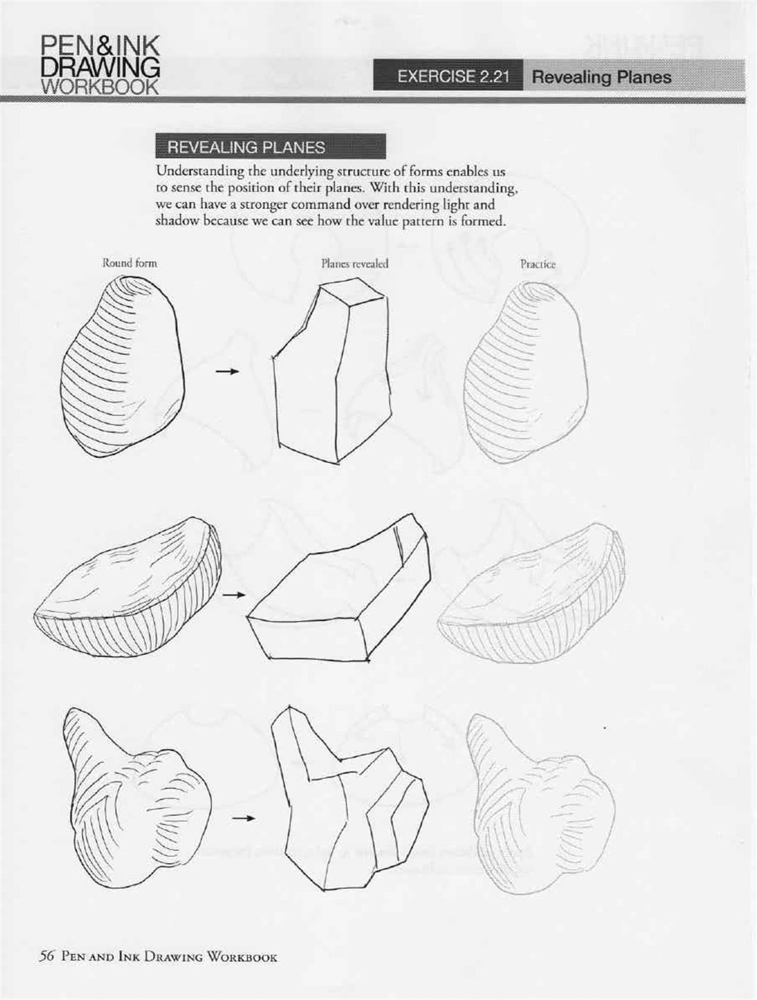
* **Contenido Original:** Deconstrucción de formas orgánicas redondeadas (canto rodado, rebanada de pan/melón, raíz de jengibre/escultura) en bloques poliédricos de planos planos ("Planes revealed").
* **Propósito Pedagógico:** La clave de todo el dibujo técnico e industrial: simplificar cualquier curva compleja en un conjunto de planos simplificados para poder calcular la luz antes de suavizarla.
* **¿Es viable en Web?:** **SÍ (100% Viable)**. Es la transición perfecta entre el módulo de cubos de Paplitz y el dibujo orgánico.
* **Variables a medir:**
  1. Rectitud de las aristas facetadas.
  2. Conexión de vértices comunes formando polígonos cerrados.
  3. Cobertura del volumen subyacente.
* **Aleatoriedad Procedural:** Generación procedural de una malla orgánica 3D y su correspondiente simplificación en un poliedro de $K$ caras.
* **Nivel Paplitz propuesto:** **Nivel 5.1 — "El Escultor de Facetas"** (Tipo: *Standard* | Dificultad: *Media*).

---

#### Página 23 — Ejercicio 2.22: Revealing Planes — Shading Organic Curves via Plane Breaks
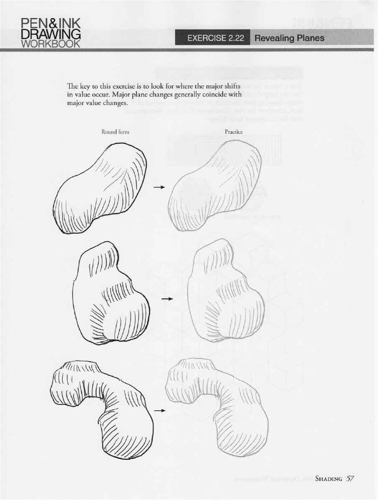
* **Contenido Original:** Sombreado de formas orgánicas identificando la cresta o arista donde se produce el cambio brusco de plano, aplicando líneas que siguen la curvatura en cada lado del quiebro.
* **Propósito Pedagógico:** Enseñar que los cambios de valor tonal en un dibujo coinciden exactamente con los cambios de dirección en los planos de la forma.
* **¿Es viable en Web?:** **SÍ (100% Viable)**.
* **Variables a medir:**
  1. Contraste tonal entre ambos lados de la arista divisoria.
* **Aleatoriedad Procedural:** Siluetas de alubias y bulbos con crestas generadas proceduralmente.
* **Nivel Paplitz propuesto:** **Nivel 5.2 — "La Cresta del Valor"** (Tipo: *Standard* | Dificultad: *Media*).

---

#### Página 24 — Ejercicio 2.23: Line Direction & Structure (La Red Isometrica de Cubos)
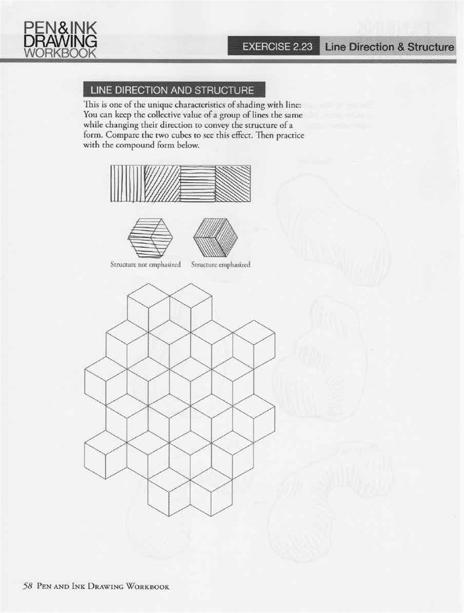
* **Contenido Original:**
  1. Comparativa de dos cubos: uno con el rayado en la misma dirección en todas las caras (pierde la estructura), y otro con el rayado paralelo a las aristas de cada cara (enfatiza la estructura 3D).
  2. Malla en panal de abeja isométrica de cubos entrelazados (*Rhombille Tiling*). El alumno debe rayar cada orientación de cara en una dirección distinta para que emerja la ilusión óptica 3D.
* **Propósito Pedagógico:** Entender que la dirección de la línea transmite orientación espacial y define la superficie independientemente de su valor de brillo.
* **¿Es viable en Web?:** **SÍ (100% Viable — Excelente para gamificación)**.
* **Variables a medir:**
  1. Ángulo de trama por cara: Caras superiores $\theta \approx 0^\circ$ (u horizontales), caras izquierdas $\theta \approx 60^\circ$, caras derechas $\theta \approx 120^\circ$.
  2. No salirse de las fronteras de cada romboide.
* **Aleatoriedad Procedural:** Laberinto procedural de cubos isométricos apilados (pirámides o bloques escalonados generados por semilla).
* **Nivel Paplitz propuesto:** **Nivel 5.3 — "El Panal Isométrico 3D"** (Tipo: *Rush / Minijuego* | Dificultad: *Media*).

---

### 🔴 BLOQUE 6: SOMBREADO DE BLOQUES Y POLIEDROS EN 3 Y 6 VALORES (PÁGS 25 A 32)

#### Páginas 25 y 26 — Ejercicios 2.25 y 2.26: 3-Value Shading on Block Forms
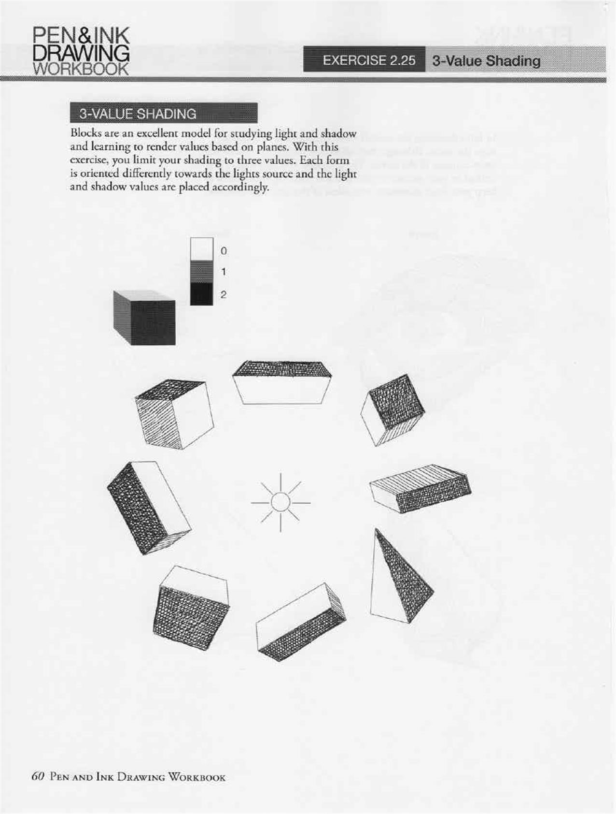
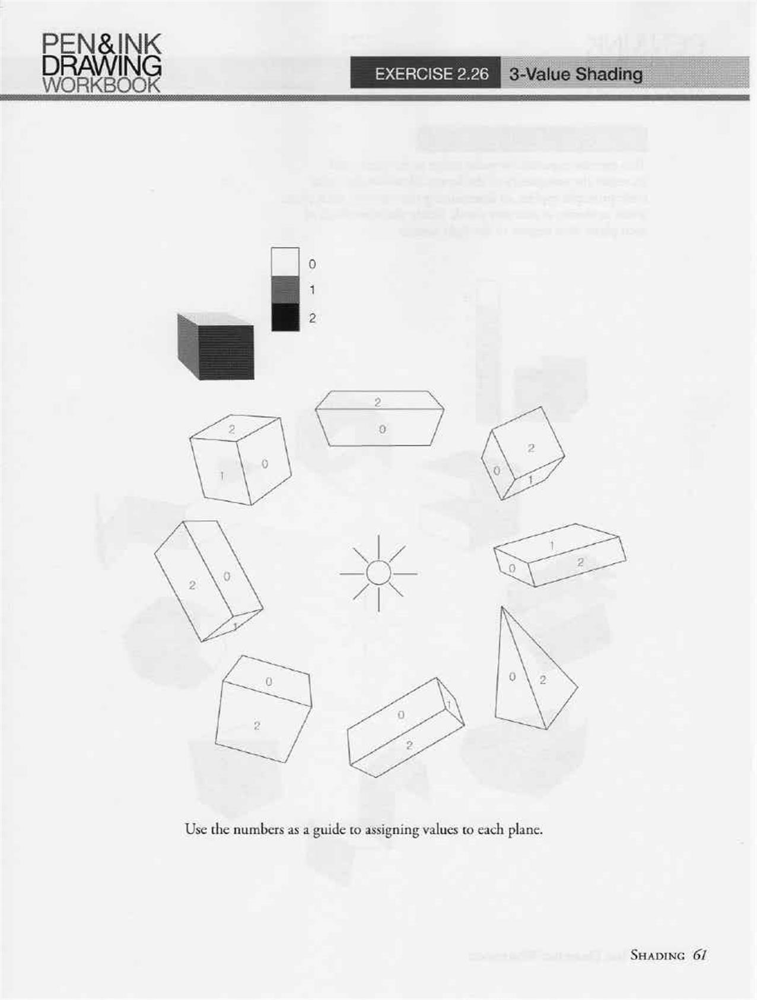
* **Contenido Original:**
  * Pág 25: 8 bloques prismáticos en círculo alrededor de un foco de luz solar central, sombreados con 3 valores (0: Blanco, 1: Medio-tono, 2: Sombra).
  * Pág 26: Plantilla con los 8 bloques en alambre y caras numeradas con su valor objetivo (0, 1, 2) según su orientación a la luz.
* **Propósito Pedagógico:** Comprender la ley del producto escalar de Lambert en arte: el valor tonal de una cara depende exclusivamente del ángulo entre la normal del plano $\vec{n}$ y el vector de luz $\vec{L}$.
* **¿Es viable en Web?:** **SÍ (100% Viable)**. Encaja de forma nativa con el motor 3D de Paplitz.
* **Variables a medir:**
  1. Densidad óptica por cara matching con el número:
     * Cara 0: $\rho < 5\%$ (Blanco)
     * Cara 1: $\rho \in [15\%, 30\%]$ (Medio-tono)
     * Cara 2: $\rho \in [45\%, 70\%]$ (Sombra oscura)
  2. Dirección de la trama coherente con la arista rectora.
* **Aleatoriedad Procedural:** Posición aleatoria del sol central y rotación aleatoria de cada prisma 3D alrededor del foco. Puede jugarse en modo guiado (números visibles) o modo examen (sin números, el alumno deduce los valores).
* **Nivel Paplitz propuesto:** **Nivel 6.1 — "La Rueda Solar de 3 Valores"** (Tipo: *Standard* | Dificultad: *Media*).

---

#### Páginas 27 y 28 — Ejercicios 2.27 y 2.28: Shading Block Forms (6-Value Range)
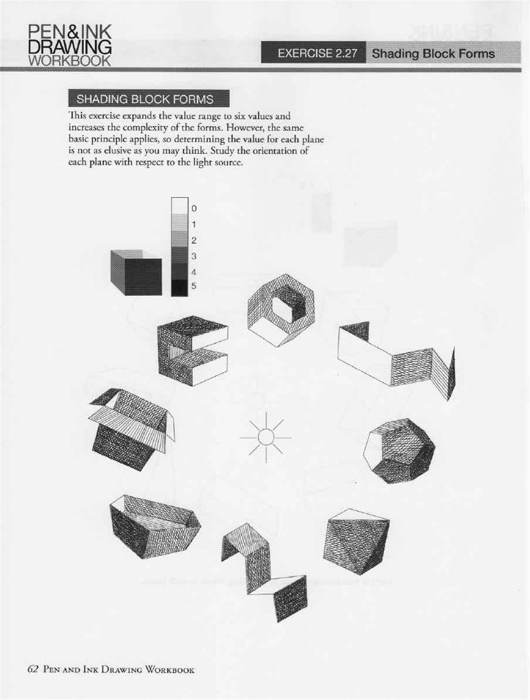
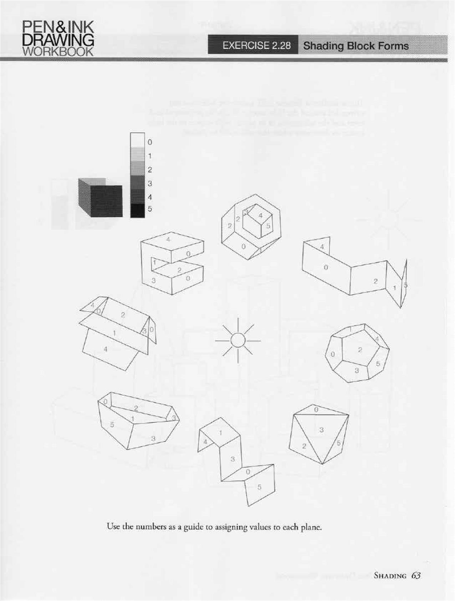
* **Contenido Original:** Ampliación del rango a 6 valores tonales discretos (0 a 5) aplicados a poliedros complejos dispuestos en círculo alrededor de la luz: caja abierta con solapas, fuelle plegado en zigzag, poliedro dodecaédrico, prisma biselado, tuerca hexagonal hueca.
* **Propósito Pedagógico:** Refinar la sensibilidad tonal para distinguir 6 niveles sutiles de gris mediante tramas más densas o cruzadas.
* **¿Es viable en Web?:** **SÍ (100% Viable)**.
* **Variables a medir:**
  1. Precisión de valor tonal en escala de 6 pasos en cada polígono.
* **Aleatoriedad Procedural:** Generación paramétrica de los poliedros y variación del foco luminoso.
* **Nivel Paplitz propuesto:** **Nivel 6.2 — "La Escala de 6 Tonos Poliédricos"** (Tipo: *Standard* | Dificultad: *Difícil*).

---

#### Página 29 — Ejercicio 2.29: Shading Block Forms — Clustered Cityscape
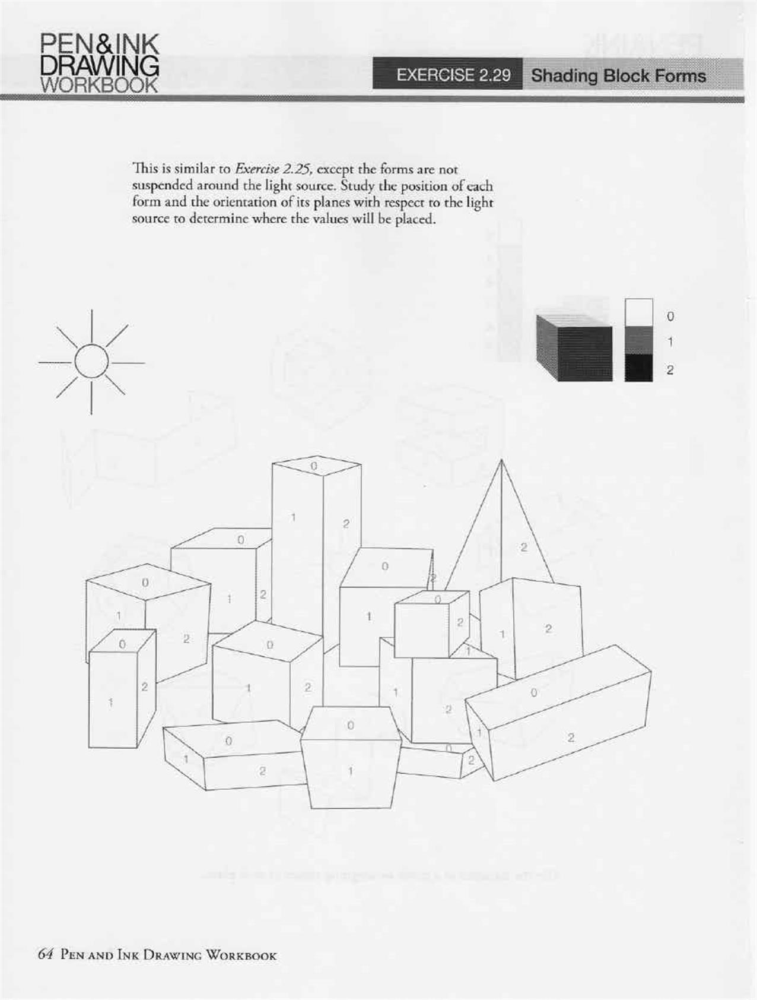
* **Contenido Original:** Composición urbana densa de bloques superpuestos con luz solar en la esquina superior izquierda. Caras numeradas (0, 1, 2) considerando planos de corte y oclusiones.
* **Propósito Pedagógico:** Sombrear una escena compleja con múltiples objetos que interactúan bajo una misma fuente de luz global distante.
* **¿Es viable en Web?:** **SÍ (100% Viable)**.
* **Variables a medir:**
  1. Consistencia global de luz en toda la escena.
  2. No manchar caras ocluidas.
* **Aleatoriedad Procedural:** Generador procedural de "Skyline" de cajas con alturas y anchos variables bajo una perspectiva común a 2 puntos de fuga.
* **Nivel Paplitz propuesto:** **Nivel 6.3 — "La Ciudadela de Bloques"** (Tipo: *Standard* | Dificultad: *Media*).

---

#### Página 30 — Ejercicio 2.30: Complex Geometric Still Life
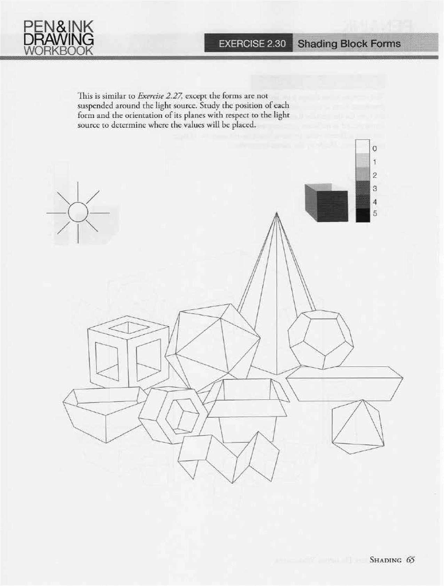
* **Contenido Original:** Bodegón de poliedros complejos (icosaedro, cubo hueco, pirámide, prisma hexagonal, fuelle, gema facetada) con sol a la izquierda. **Sin números de guía.**
* **Propósito Pedagógico:** Examen de deducción física: el estudiante debe calcular mentalmente el ángulo de cada cara respecto a la luz y aplicarle el tono de 0 a 5 correspondiente.
* **¿Es viable en Web?:** **SÍ (100% Viable)**.
* **Variables a medir:**
  1. Orden relativo de valores: Si el algoritmo 3D calcula que el ángulo del plano A con la luz es mayor que el del plano B, la densidad dibujada en A debe ser estrictamente menor que en B ($\rho_A < \rho_B$).
* **Aleatoriedad Procedural:** Composición aleatoria de 4 o 5 poliedros de una biblioteca de mallas procedurales.
* **Nivel Paplitz propuesto:** **Nivel 6.4 — "Bodegón Poliédrico a Ciegas"** (Tipo: *Exam* | Dificultad: *Difícil*).

---

#### Páginas 31 y 32 — Ejercicios 2.31 y 2.32: Dominant Form Composition
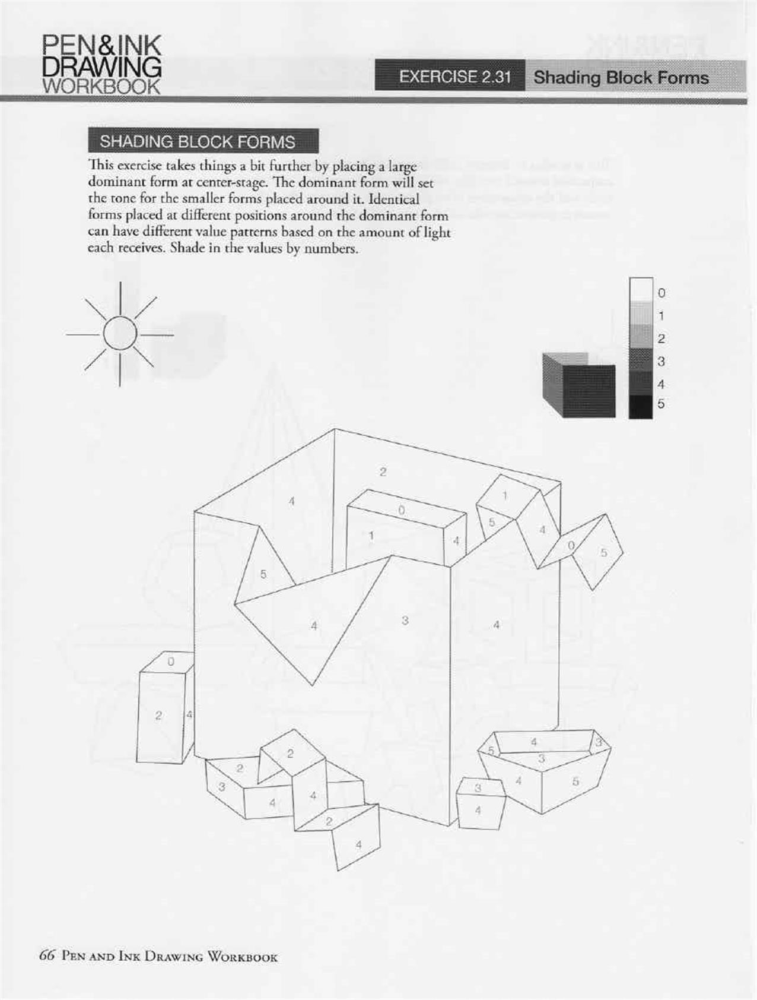
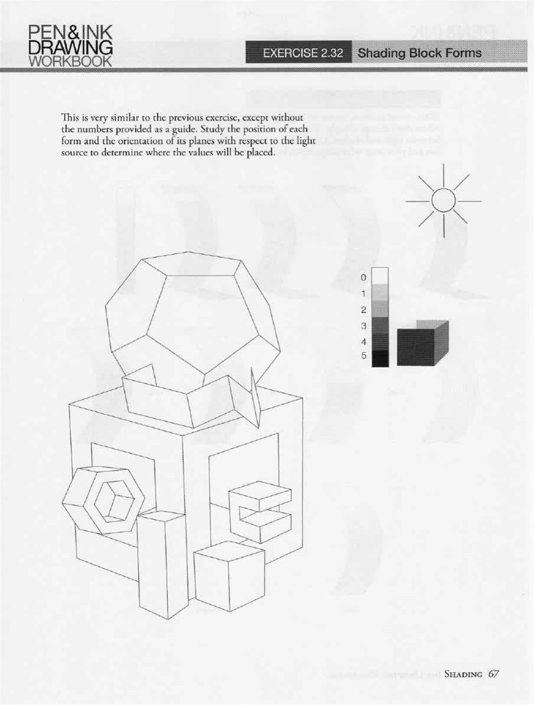
* **Contenido Original:**
  * Pág 31: Una gran caja cúbica dominante en el centro con formas subordinadas adheridas (solapas abiertas, prismas encastrados, cajas satélite). Guiado con números 0 a 5.
  * Pág 32: Conjunto arquitectónico complejo sin números de guía con foco de luz en la esquina superior derecha.
* **Propósito Pedagógico:** Comprender la jerarquía visual: el cuerpo dominante fija el valor de referencia de toda la composición, y los elementos menores deben mantener una escala armónica.
* **¿Es viable en Web?:** **SÍ (100% Viable)**.
* **Variables a medir:**
  1. Relación de contraste entre la forma dominante y los elementos anexos.
* **Aleatoriedad Procedural:** Generación de ensamblajes de cajas maestras con satélites aleatorios en sus caras.
* **Nivel Paplitz propuesto:** **Nivel 6.5 — "El Monolito Dominante"** (Tipo: *Exam* | Dificultad: *Difícil*).

---

### ⚪ BLOQUE 7: SOMBREADO DE SUPERFICIES CURVAS, CILINDROS Y ESFERAS (PÁGS 33 A 37)

#### Páginas 33 y 34 — Ejercicios 2.33 y 2.34: Shading Curved Surfaces (Ribbons)
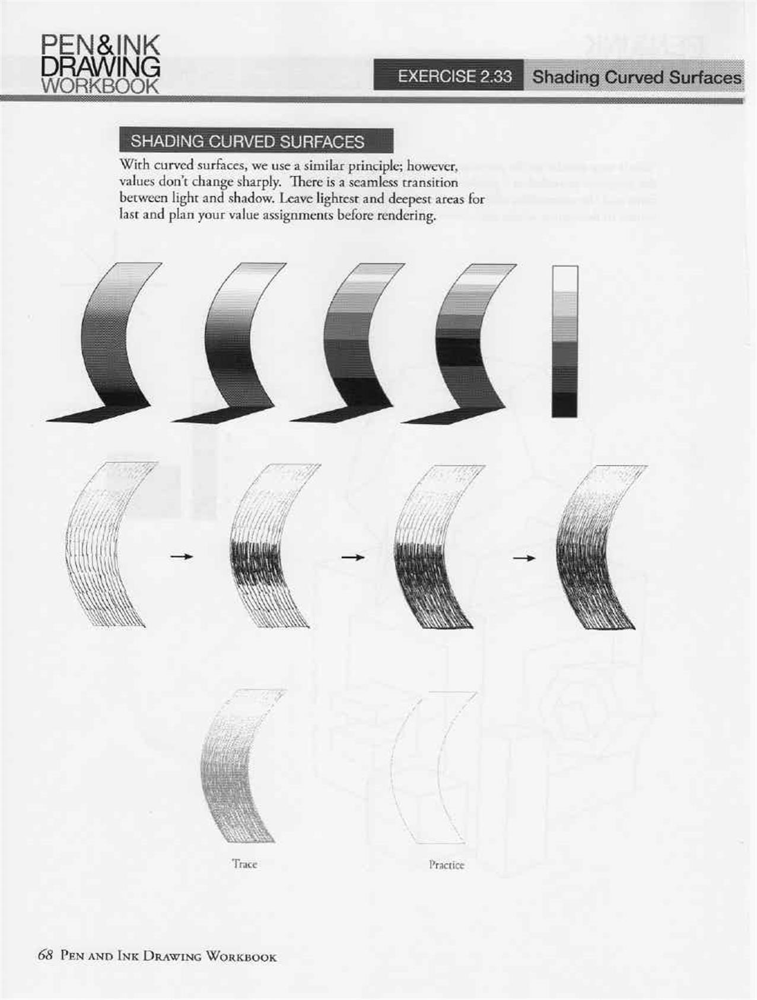
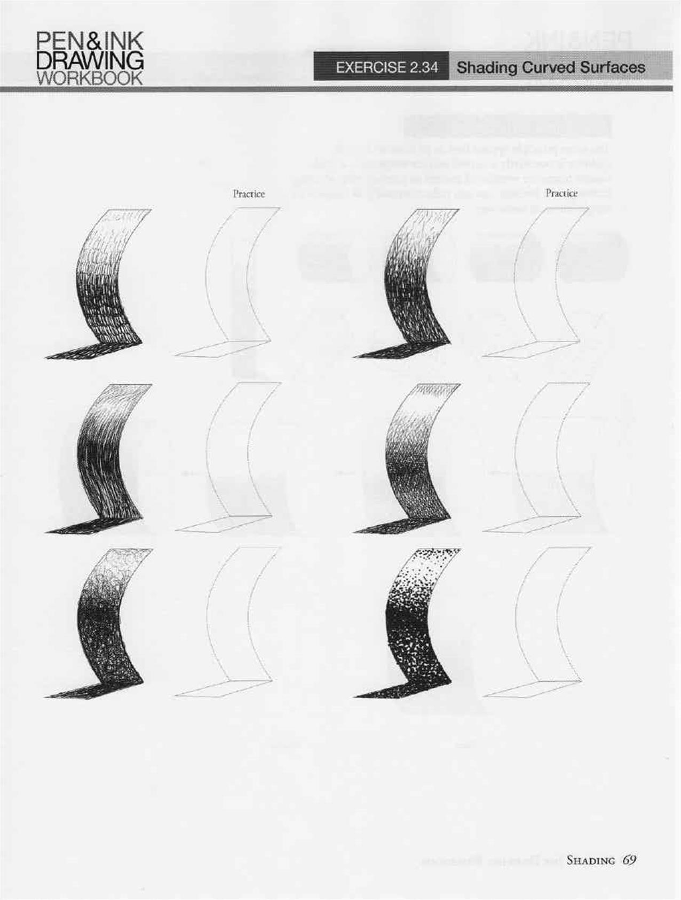
* **Contenido Original:**
  * Pág 33: Sombreado de una cinta/banda curva con gradiente continuo sin quiebros bruscos. Muestra el proceso en 4 pasos: capa suave $\to$ densificación del medio-tono $\to$ profundización de la sombra núcleo $\to$ acabado final.
  * Pág 34: Práctica de sombreado de la misma cinta curva empleando 6 técnicas diferentes (*Hatching*, *Cross-Hatching*, *Uneven*, *Scribbling*, *Stippling*, *Flowing Lines*).
* **Propósito Pedagógico:** Aprender que en superficies curvas no existen aristas afiladas, sino una zona de penumbra continua y una "sombra núcleo" (*core shadow*) suave.
* **¿Es viable en Web?:** **SÍ (100% Viable)**.
* **Variables a medir:**
  1. Curva de gradiente continuo: $I(s) \propto \cos(\phi(s))$ a lo largo del desarrollo de la cinta.
  2. Ausencia de líneas de corte duras.
* **Aleatoriedad Procedural:** Curvatura de la cinta y dirección del vector de iluminación.
* **Nivel Paplitz propuesto:** **Nivel 7.1 — "La Cinta Continua"** (Tipo: *Standard* | Dificultad: *Media*).

---

#### Páginas 35 y 36 — Ejercicios 2.35 y 2.36: Shading Cylinders in Perspective
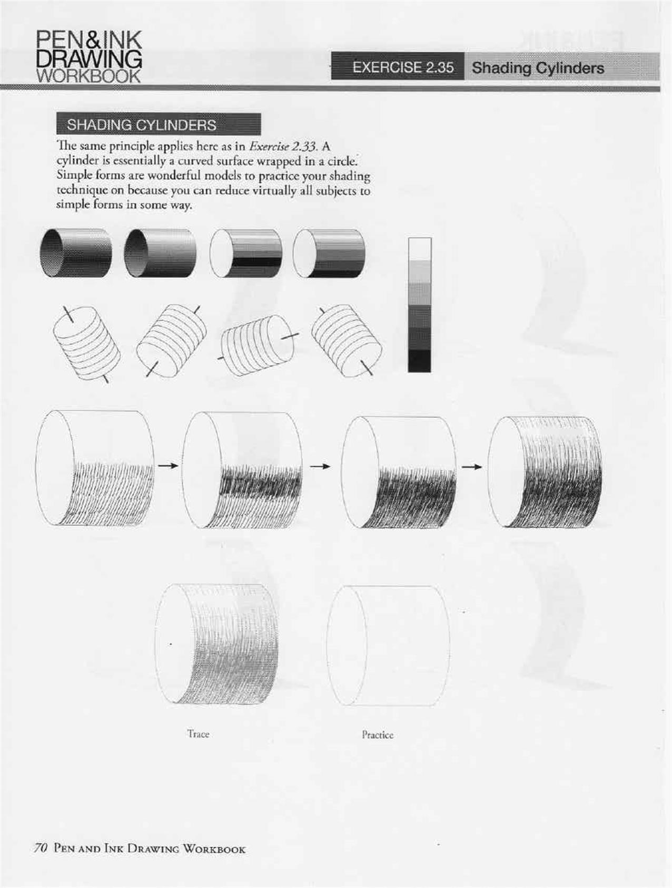
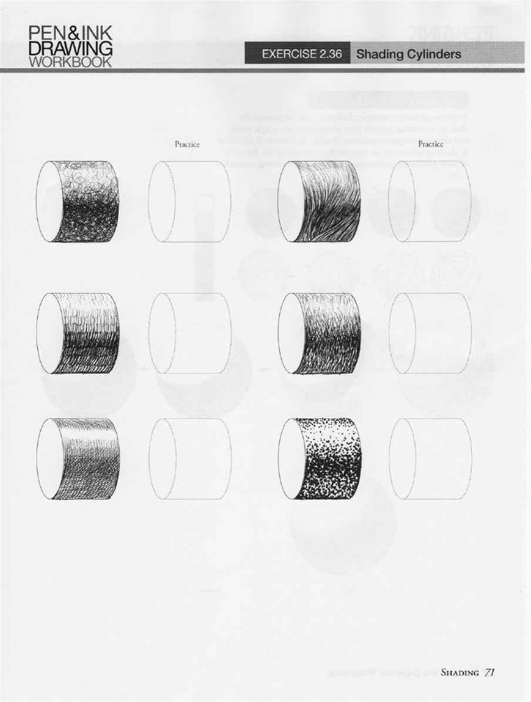
* **Contenido Original:**
  * Pág 35: Cilindros en perspectiva. Análisis de la dirección de la trama (trama longitudinal a lo largo de las generatrices vs trama elíptica transversal de contorno cruzado). Muestra la luz reflejada en el borde inferior.
  * Pág 36: Sombreado de 6 cilindros idénticos utilizando las distintas técnicas (*scribbling, flowing, axial hatching, cross-contour, cross-hatching, stippling*).
* **Propósito Pedagógico:** Masterizar el cilindro, que es la forma primitiva fundamental para brazos, piernas, botellas, tuberías y vehículos. Entender la diferencia entre la sombra núcleo y la luz reflejada.
* **¿Es viable en Web?:** **SÍ (100% Viable)**.
* **Variables a medir:**
  1. Posición de la sombra núcleo: Debe ubicarse en la generatriz donde la normal del cilindro es ortogonal al vector de luz.
  2. Presencia de banda de luz reflejada tenue en el borde de fuga.
  3. Dirección de las líneas paralela al eje o siguiendo las elipses de las tapas.
* **Aleatoriedad Procedural:** Orientación 3D del cilindro en perspectiva cónica y posición de la fuente de luz.
* **Nivel Paplitz propuesto:** **Nivel 7.2 — "El Cilindro y la Sombra Núcleo"** (Tipo: *Standard* | Dificultad: *Media*).

---

#### Página 37 — Ejercicio 2.37: Shading Spherical Forms
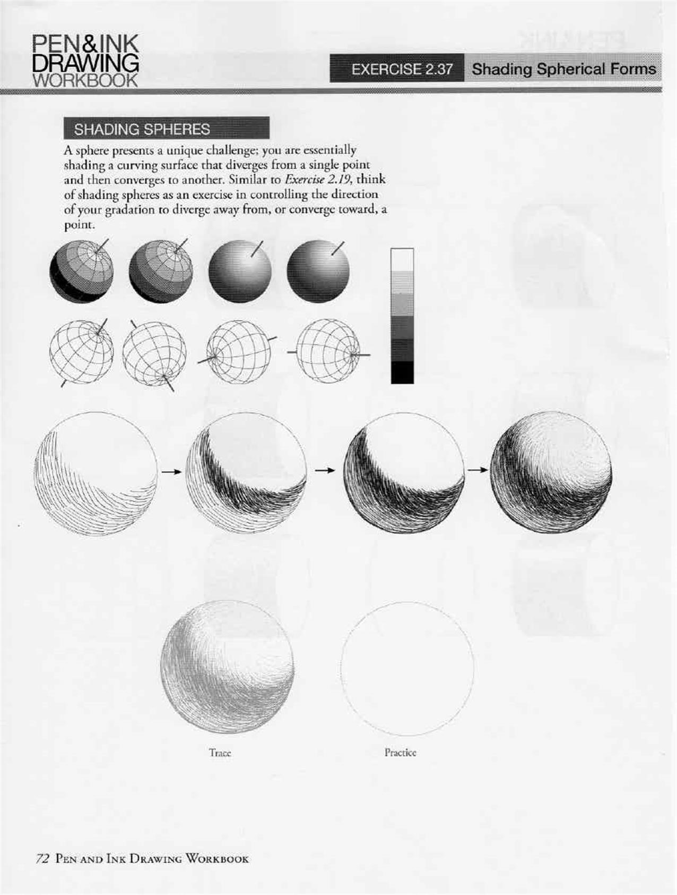
* **Contenido Original:** Sombreado de esferas. Ilustra la red de meridianos y paralelos mostrando cómo los trazos deben divergir del punto de brillo (*highlight*) y converger hacia el polo opuesto. Análisis de la franja creciente de la sombra terminadora, la sombra núcleo y la luz reflejada del suelo.
* **Propósito Pedagógico:** La esfera es la prueba de fuego del dibujante: exige trazos en arco esférico que cambian continuamente de ángulo y curvatura.
* **¿Es viable en Web?:** **SÍ (100% Viable)**.
* **Variables a medir:**
  1. Curvatura de trazo en arcos de elipse congruentes con la esfera proyectada.
  2. Ubicación del brillo especular y forma semilunar de la sombra núcleo.
* **Aleatoriedad Procedural:** Coordenadas 3D del foco de luz $(\theta, \phi)$ y radio de la esfera.
* **Nivel Paplitz propuesto:** **Nivel 7.3 — "La Esfera y el Terminador"** (Tipo: *Exam* | Dificultad: *Difícil*).

---

### 🟤 BLOQUE 8: COMPOSICIONES DE SÓLIDOS, VALOR LOCAL Y FORMAS COMPUESTAS (PÁGS 38 A 42)

#### Páginas 38 y 39 — Ejercicios 2.38 / 2.39 y 2.40: Simple & Advanced Forms Compositions
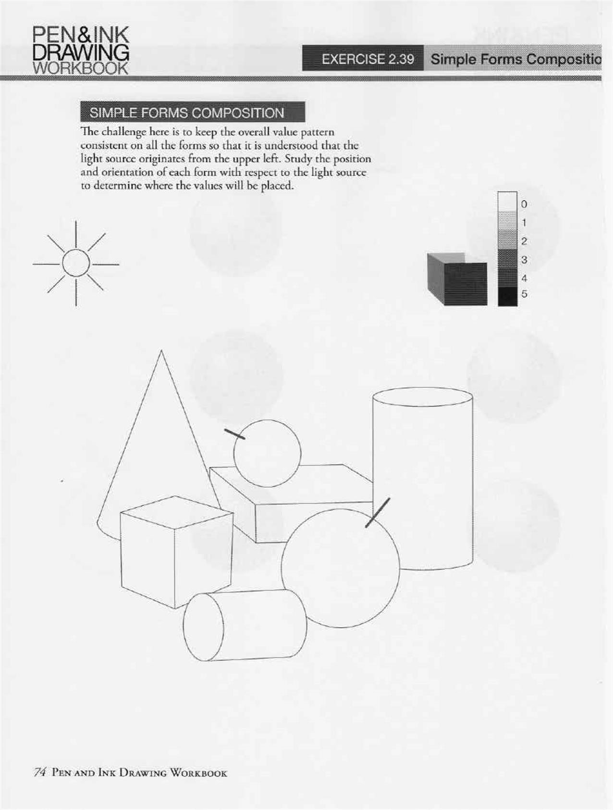
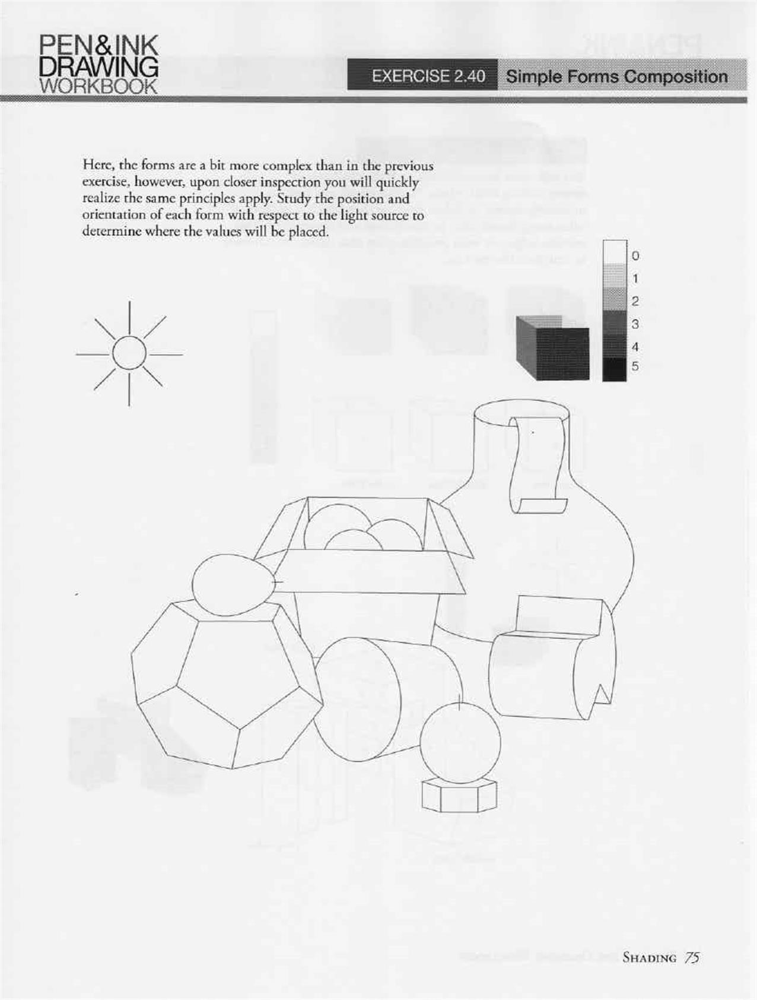
* **Contenido Original:**
  * Pág 38: Bodegón de primitivas puras: cono, cubo, esferas con varillas de eje, cilindro horizontal, cilindro vertical, plinto rectangular. Foco superior izquierdo.
  * Pág 39: Bodegón avanzado: jarrón con cuello curvo, caja de cartón abierta con esferas en su interior, icosaedro, cilindro horizontal, asiento curvo.
* **Propósito Pedagógico:** Integrar en una sola escena el sombreado de caras planas (valores uniformes) y el sombreado de caras curvas (gradaciones continuas) bajo un único sistema coherente de iluminación.
* **¿Es viable en Web?:** **SÍ (100% Viable)**.
* **Variables a medir:**
  1. Coherencia global de iluminación: La sombra propia y las sombras arrojadas de todos los objetos deben obedecer al mismo vector $\vec{L}$.
* **Aleatoriedad Procedural:** Configuración de la mesa de bodegón ensamblada con piezas de una biblioteca paramétrica.
* **Nivel Paplitz propuesto:** **Nivel 8.1 — "El Gran Bodegón de Primitivas"** (Tipo: *Standard* | Dificultad: *Difícil*).

---

#### Página 40 — Ejercicio 2.41: Local Value (Valor Local y Albedo)
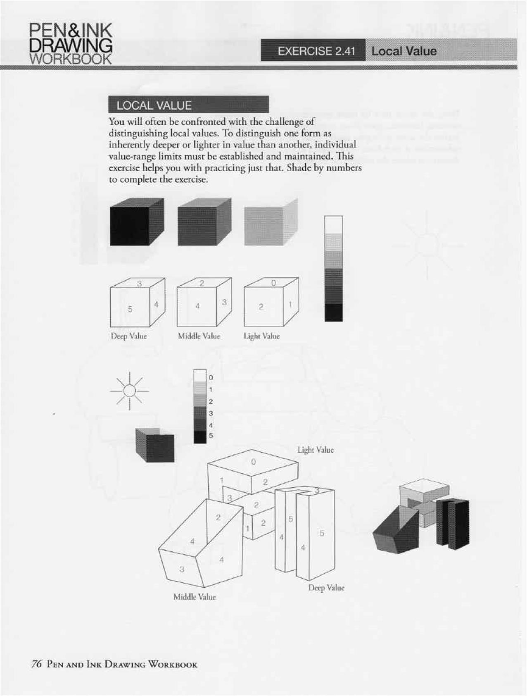
* **Contenido Original:**
  * Arriba: Tres cubos bajo la misma luz pero con diferente color propio (*local value*): Cubo Negro (*Deep Value*), Cubo Gris (*Middle Value*) y Cubo Blanco (*Light Value*). Demuestra que la cara en sombra de un cubo blanco puede ser más clara que la cara iluminada de un cubo negro.
  * Abajo: Ensamblaje arquitectónico entrelazado donde cada bloque tiene un valor local inherente diferente.
* **Propósito Pedagógico:** Uno de los errores más graves del estudiante es ignorar el color del objeto al sombrear. Este ejercicio enseña a desplazar la escala de grises según el albedo del material.
* **¿Es viable en Web?:** **SÍ (100% Viable — Concepto de oro para rendering)**.
* **Variables a medir:**
  1. Offset de valor local: Para una cara $j$ del objeto $k$:
     $$\text{Densidad Requerida } \rho_{j,k} = \text{Albedo}(k) + \text{Sombreado}(\vec{n}_j \cdot \vec{L})$$
* **Aleatoriedad Procedural:** Asignación aleatoria de tonos base (blanco, gris claro, grafito, negro carbón) a los componentes de la estructura.
* **Nivel Paplitz propuesto:** **Nivel 8.2 — "El Albedo de los Materiales"** (Tipo: *Standard* | Dificultad: *Difícil*).

---

#### Página 41 — Ejercicio 2.45: Compound Forms (Fusión de Formas Compuestas)
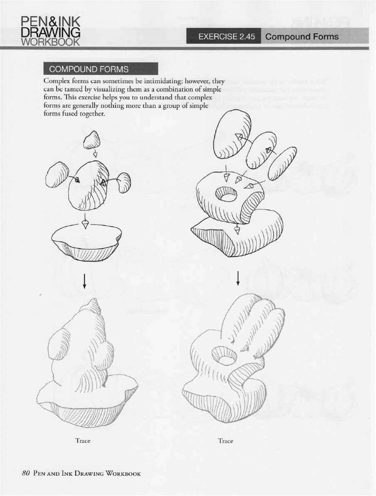
* **Contenido Original:** Vista explosionada de formas orgánicas simples (gotas, discos perforados, cuñas) que se ensamblan mediante flechas rectoras para constituir una escultura orgánica compleja y unificada. Muestra el sombreado con contornos cruzados sobre la figura fusionada final.
* **Propósito Pedagógico:** Demostrar que los personajes, animales, vehículos y piezas de diseño complejas no se dibujan de golpe, sino que son la suma de formas elementales fusionadas.
* **¿Es viable en Web?:** **SÍ (100% Viable para sombreado sobre la silueta dada)**.
* **Variables a medir:**
  1. Transición de contornos cruzados en la zona de intersección o soldadura de las piezas.
* **Aleatoriedad Procedural:** Piezas paramétricas ensambladas con traslaciones aleatorias a lo largo de un eje común.
* **Nivel Paplitz propuesto:** **Nivel 8.3 — "Fusión Orgánica de Piezas"** (Tipo: *Standard* | Dificultad: *Difícil*).

---

#### Página 42 — Ejercicio 2.46: Compound Forms — Synthesis & Creative Assembly
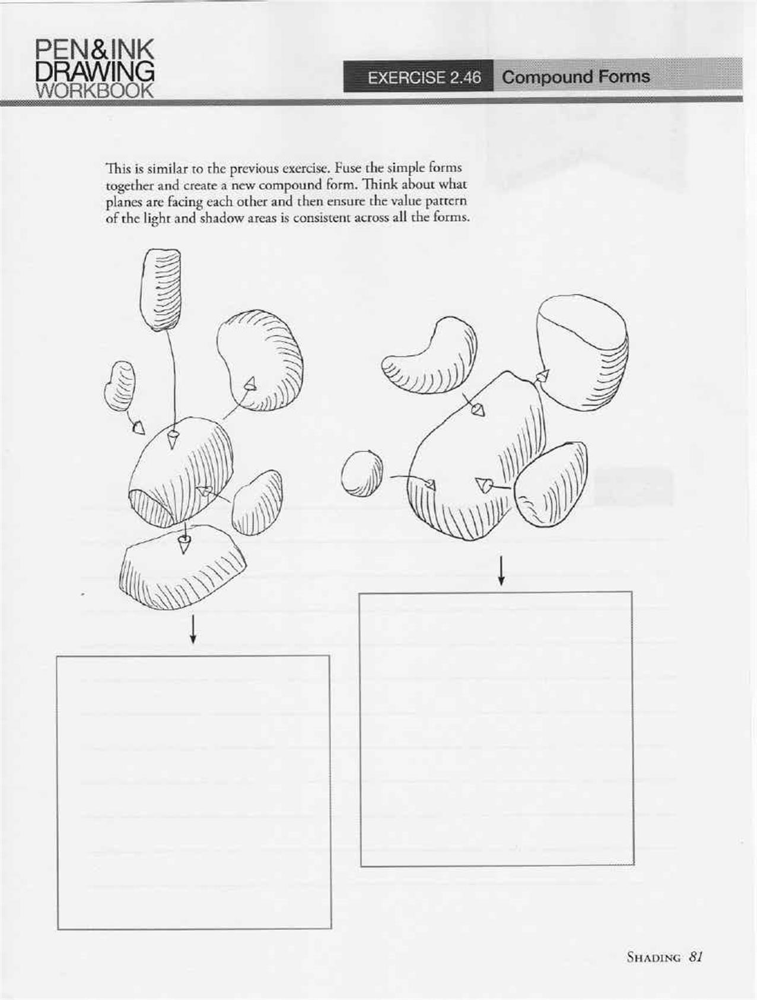
* **Contenido Original:** Cuatro formas orgánicas flotantes con flechas de ensamble libre en la parte superior, y un marco en blanco en la parte inferior para que el alumno dibuje desde su imaginación el cuerpo fusionado y lo sombree coherentemente.
* **Propósito Pedagógico:** Ejercicio de síntesis y creatividad pura: unir y sombrear sin guía previa.
* **¿Es viable en Web?:** **PARCIALMENTE VIABLE (Con matices algorítmicos)**.
  * *¿Por qué tiene un reto especial?*: En una corrección puramente matemática determinista, si el usuario inventa una silueta 100% libre desde su imaginación, el algoritmo no tiene una curva matemática "verdadera" contra la que contrastar el trazo.
  * *Solución Elegante para Paplitz*: En la web, Paplitz presentará una **silueta procedural translúcida ("fantasma")** o un conjunto de **puntos de anclaje magnéticos** que el usuario debe conectar e interpretar, o bien se evalúa la consistencia física de la luz proyectada sobre la silueta que el usuario dibuje. De este modo, el ejercicio se vuelve $100\%$ corregible de forma objetiva.
* **Nivel Paplitz propuesto:** **Nivel 8.4 — "Examen de Maestría: Síntesis de Formas"** (Tipo: *Exam* | Dificultad: *Experto*).

---

## 5. Matriz Comparativa de Viabilidad y Retos Técnicos

| Bloque Temático | Páginas | Total Ejercicios | Viabilidad Web | Dificultad de Implementación | Métrica Principal de Validación |
| :--- | :---: | :---: | :---: | :---: | :--- |
| **Bloque 1: Consistencia & Calistenia** | 1 – 8 | 8 | 🟢 100% Viable | Media | $\sigma_{\text{spacing}}$, $\sigma_\theta$, Rectitud, Aceleración terminal |
| **Bloque 2: Trazos Fundamentales & Trama** | 9 – 13 | 5 | 🟢 100% Viable | Fácil | Clasificador de estilo, Densidad óptica $\rho$, Varianza de celda |
| **Bloque 3: Contornos Cruzados (3D)** | 14 – 17 | 4 | 🟢 100% Viable | Media-Alta | Perpendicularidad a eje $\vec{t}$, Curvatura Bézier, Anclaje en borde |
| **Bloque 4: Valor Plano & Gradación** | 18 – 21 | 4 | 🟢 100% Viable | Media | Varianza espacial de densidad, Gradiente $\nabla\rho$ vs $\vec{D}$ |
| **Bloque 5: Planos, Facetas & Isometría** | 22 – 24 | 3 | 🟢 100% Viable | Media | Ángulo de trama por cara normal, Rectitud de facetas |
| **Bloque 6: Sombreado de Poliedros** | 25 – 32 | 8 | 🟢 100% Viable | Media | Densidad por polígono $\rho \approx \text{Lambert}(\vec{n} \cdot \vec{L})$ |
| **Bloque 7: Sombreado Curvo, Cilindro, Esfera**| 33 – 37 | 5 | 🟢 100% Viable | Alta | Sombra núcleo, Luz reflejada, Arcos esféricos |
| **Bloque 8: Composiciones & Síntesis** | 38 – 42 | 5 | 🟡 95% Viable (Pág 42 requiere guía fantasma) | Alta | Coherencia global de luz $\vec{L}$, Offset de albedo |

* **Total de Páginas Analizadas:** 42 de 42.
* **Páginas 100% Viables de forma directa:** 41.
* **Páginas con adaptación procedural recomendada:** 1 (Pág 42, con silueta guía adaptable).

---

## 6. Arquitectura de Código en TypeScript para Paplitz

Para integrar este universo de ejercicios en la base de código existente de Paplitz sin romper el módulo actual de cubos, se propone la siguiente arquitectura modular desacoplada:

```
src/
├── lib/
│   ├── strokeChallengeEngine.ts   <-- Generador procedural de retos de trazo
│   ├── strokeValidation.ts        <-- Motor matemático de medición y scoring
│   ├── strokeCurriculumData.ts    <-- Árbol de unidades y nodos de trazo
├── components/
│   ├── StrokeCanvas.tsx           <-- Canvas optimizado con PointerEvents & Tinta
│   ├── StrokeLabView.tsx          <-- Laboratorio de pruebas y modo práctica libre
```

### 6.1 Modelo de Datos TypeScript (`strokeCurriculumData.ts`)

```typescript
export type StrokeExerciseType = 
  | 'line_consistency'     // Págs 1, 3
  | 'chevron_corners'      // Pág 4
  | 'smooth_curves'        // Pág 5
  | 'radial_focal'         // Pág 6
  | 'trailing_flicks'      // Págs 7, 8
  | 'basic_strokes_grid'   // Págs 9, 10
  | 'hatching_parameters'  // Págs 11, 12, 13
  | 'cross_contour_organic'// Págs 14, 15, 16, 17
  | 'even_value_strip'     // Págs 18, 19
  | 'directional_gradient' // Págs 20, 21
  | 'revealing_planes'     // Págs 22, 23
  | 'isometric_rhombille'  // Pág 24
  | 'polyhedron_shading'   // Págs 25-32
  | 'cylinder_shading'     // Págs 35, 36
  | 'sphere_shading'       // Pág 37
  | 'composition_stilllife'// Págs 38-40
  | 'compound_fusion';     // Págs 41, 42

export interface StrokeChallenge {
  id: string;
  type: StrokeExerciseType;
  title: string;
  seed: number;
  promptInstruction: string;
  // Parámetros de aleatoriedad
  targetAngleDeg: number;       // ej: 67.5°
  targetSpacingPx: number;      // ej: 14px
  targetLengthPx: number;       // ej: 120px
  targetValueLevel?: number;    // 0 a 5
  guideLines: { x1: number; y1: number; x2: number; y2: number }[];
  targetBoundingPolygon?: { x: number; y: number }[];
  // Datos 3D en caso de ejercicios de volumen o sombreado
  lightVector?: { x: number; y: number; z: number };
  faces?: {
    vertices: { x: number; y: number }[];
    targetValue: number;        // 0 a 5
    normal: { x: number; y: number; z: number };
  }[];
}
```

### 6.2 Métricas de Validación en Tiempo Real (`strokeValidation.ts`)

```typescript
export interface StrokeValidationResult {
  overallScore: number;         // 0 a 100
  passed: boolean;              // >= 75
  subScores: {
    parallelismScore: number;   // Regularidad angular
    spacingScore: number;       // Equidistancia y ritmo
    straightnessScore: number;  // Firmeza del trazo sin titubeos
    valueAccuracyScore: number; // Fidelidad al tono objetivo (0-5)
    boundaryScore: number;      // Respeto a los márgenes
  };
  detectedStats: {
    strokeCount: number;
    averageSpacingPx: number;
    spacingVariance: number;
    averageAngleDeg: number;
    measuredOpticalDensity: number;
  };
  feedbackMessage: string;
  avatarExpression: 'happy' | 'thinking' | 'surprised' | 'zen';
}
```

---

## 7. Propuesta de "El Camino de Trazado" (Curriculum Tree)

A continuación se estructura la progresión completa organizada en **8 Unidades Pedagógicas**, diseñada para convivir en el selector de módulos de Paplitz junto a *"Paralelepípedos & Cajas"*:

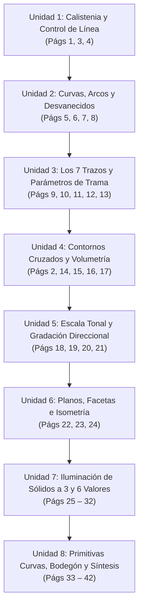
```mermaid
graph TD
    U1["Unidad 1: Calistenia y Control de Línea<br/>(Págs 1, 3, 4)"] --> U2["Unidad 2: Curvas, Arcos y Desvanecidos<br/>(Págs 5, 6, 7, 8)"]
    U2 --> U3["Unidad 3: Los 7 Trazos y Parámetros de Trama<br/>(Págs 9, 10, 11, 12, 13)"]
    U3 --> U4["Unidad 4: Contornos Cruzados y Volumetría<br/>(Págs 2, 14, 15, 16, 17)"]
    U4 --> U5["Unidad 5: Escala Tonal y Gradación Direccional<br/>(Págs 18, 19, 20, 21)"]
    U5 --> U6["Unidad 6: Planos, Facetas e Isometría<br/>(Págs 22, 23, 24)"]
    U6 --> U7["Unidad 7: Iluminación de Sólidos a 3 y 6 Valores<br/>(Págs 25 – 32)"]
    U7 --> U8["Unidad 8: Primitivas Curvas, Bodegón y Síntesis<br/>(Págs 33 – 42)"]
```

### Detalle de Unidades y Niveles:

* **UNIDAD 1: Calistenia y Control de Línea (Págs 1, 3, 4)**
  * `L1.1` *(Warmup)*: El Metrónomo — Espaciado y longitud uniforme en vertical.
  * `L1.2` *(Standard)*: La Rosa de los Vientos — 8 direcciones de rectas firmes.
  * `L1.3` *(Standard)*: Quiebros y Esquinas — Freno seco en chevrones y zigzags.
  * `L1.4` *(Exam)*: Examen de Calistenia — Reto procedural de paralelismo rotado.

* **UNIDAD 2: Curvas, Arcos y Desvanecidos (Págs 5, 6, 7, 8)**
  * `L2.1` *(Standard)*: Arcos en C y Ondas en S sinusoidales.
  * `L2.2` *(Standard)*: Molinetes y Llamas Confluentes.
  * `L2.3` *(Standard)*: Plumas y Despegue de Tinta (*Trailing Flicks*).
  * `L2.4` *(Exam)*: La Oruga Espacial — Nervaduras normales sobre spline curva.

* **UNIDAD 3: Los 7 Trazos y Parámetros de Trama (Págs 9, 10, 11, 12, 13)**
  * `L3.1` *(Standard)*: Los 7 Maestros — Hatching, Cross-hatch, Scribble, Stippling.
  * `L3.2` *(Standard)*: Variaciones de Trama — Paso, capas y grosor.
  * `L3.3` *(Standard)*: Malla Cruzada en Diamante y Ortogonal.
  * `L3.4` *(Rush)*: Pelaje y Corteza — Trama irregular continua sin costuras.

* **UNIDAD 4: Contornos Cruzados y Volumetría Orgánica (Págs 2, 14, 15, 16, 17)**
  * `L4.1` *(Standard)*: El Alambre del Volumen — Abrazar peras, cuñas y alubias.
  * `L4.2` *(Standard)*: El Eje Rector — Blobs con varilla de orientación 3D.
  * `L4.3` *(Standard)*: Canalones y Conchas Cóncavas.
  * `L4.4` *(Exam)*: Torsiones Complejas — Cinturones espaciales en 3D.

* **UNIDAD 5: Escala Tonal y Gradación Direccional (Págs 18, 19, 20, 21)**
  * `L5.1` *(Standard)*: La Franja Plana — Mantener el mismo gris en 10 cm.
  * `L5.2` *(Standard)*: El Mapa Topográfico de 6 Estratos de Gris.
  * `L5.3` *(Standard)*: El Flujo del Degradado — Gradiente a lo largo de un pétalo y toroide.
  * `L5.4` *(Exam)*: Campanas y Cuencos — Gradientes convergentes y divergentes.

* **UNIDAD 6: Planos, Facetas e Isometría (Págs 22, 23, 24)**
  * `L6.1` *(Standard)*: El Escultor Low-Poly — Devolver rocas a prismas facetados.
  * `L6.2` *(Standard)*: La Cresta del Valor — Transición en el quiebro de plano.
  * `L6.3` *(Rush)*: El Panal Isométrico — Ilusión 3D por dirección de trama.

* **UNIDAD 7: Iluminación de Sólidos a 3 y 6 Valores (Págs 25 a 32)**
  * `L7.1` *(Standard)*: La Rueda Solar de 3 Valores (Con números de guía).
  * `L7.2` *(Standard)*: Rueda Solar a Ciegas (Deducción de $\vec{n} \cdot \vec{L}$).
  * `L7.3` *(Standard)*: La Escala de 6 Tonos Poliédricos.
  * `L7.4` *(Standard)*: Skyline de Ciudadela bajo luz solar lejana.
  * `L7.5` *(Exam)*: El Monolito Dominante y Formas Satélite.

* **UNIDAD 8: Primitivas Curvas, Bodegón y Síntesis (Págs 33 a 42)**
  * `L8.1` *(Standard)*: La Cinta Curva Continua.
  * `L8.2` *(Standard)*: El Cilindro — Sombra núcleo y luz reflejada.
  * `L8.3` *(Standard)*: La Esfera y la Sombra Creciente del Terminador.
  * `L8.4` *(Standard)*: El Albedo de los Materiales (Cubo blanco vs cubo negro).
  * `L8.5` *(Exam Final)*: El Gran Bodegón de Primitivas y Síntesis de Formas.

---

## 8. Laboratorio Interactivo Beta (Demo Funcional en Web)

Para comprobar de forma tangible la viabilidad de estos algoritmos en el propio entorno de ejecución de Paplitz, se ha implementado un componente de laboratorio interactivo: **`StrokeLabView.tsx`**.

### Características del Prototipo Implementado:
1. **Selector de Ejercicios Representativos:**
   * *Nivel 1: Control de Líneas & Espaciado (Ex 1.1 / 1.3)* — Mide paralelismo angular $\sigma_\theta$, constancia de paso $\sigma_{\text{spacing}}$ y rectitud.
   * *Nivel 2: Ondas en S & Dinámica Fluida (Ex 1.5)* — Mide continuidad $C^2$ y seguimiento sinusoidal.
   * *Nivel 3: Trama Paralela y Densidad Óptica (Ex 1.9 / 1.11)* — Calcula el porcentaje de valor gris entintado dentro de un marco.
   * *Nivel 4: Contornos Cruzados sobre Blobs Procedurales (Ex 2.5 / 2.6)* — Genera una silueta orgánica 3D única con eje rector y mide si las líneas del usuario envuelven el volumen ortogonalmente.
   * *Nivel 5: Sombreado de Bloques 3D a 3 Valores (Ex 2.25)* — Renderiza un prisma 3D procedural con sol cenital e inspecciona la densidad por cara.
2. **Motor de Reto Aleatorio ("Anti-Memoria Muscular"):** Cada pulsación del botón genera nuevos ángulos de tiro, separaciones diana y geometrías, garantizando que nunca se dibuje el mismo patrón dos veces.
3. **Panel de Desglose Matemático:** Muestra en tiempo real las puntuaciones parciales de paralelismo, ritmo, rectitud y valor con feedback emocional del Sensei Cubo.

---
*Fin del Documento de Especificación.*
